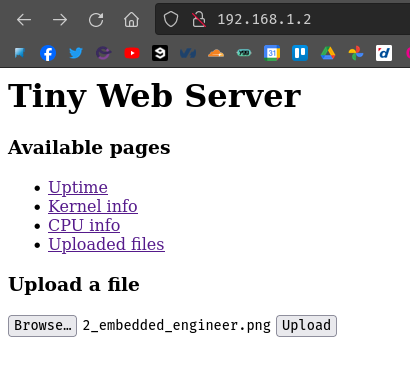
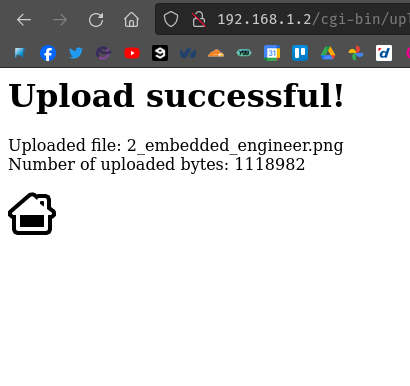
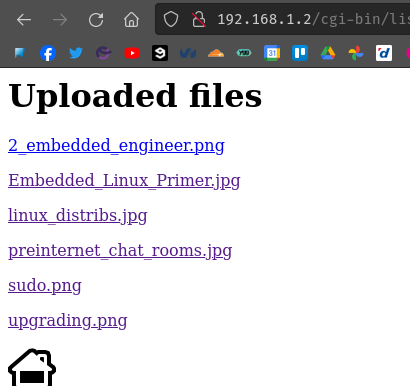
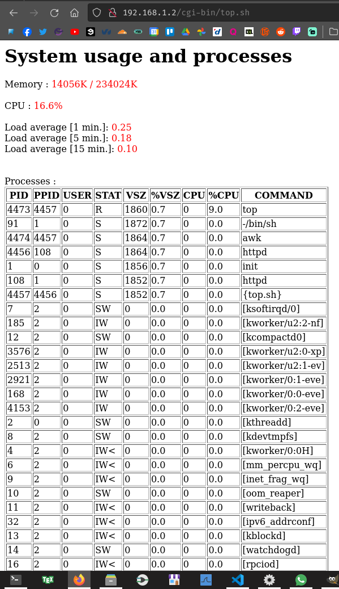

# Lab 4 - Mini système embarqué avec Busybox

# Table des matières
- [Lab 4 - Mini système embarqué avec Busybox](#lab-4---mini-système-embarqué-avec-busybox)
- [Table des matières](#table-des-matières)
- [Instruction \& Description](#instruction--description)
- [Mise en place de la communication série avec la carte](#mise-en-place-de-la-communication-série-avec-la-carte)
  - [Branchements sur la carte](#branchements-sur-la-carte)
  - [Picocom](#picocom)
- [Laboratoire \& Questions](#laboratoire--questions)
  - [Mise en place du serveur NFS](#mise-en-place-du-serveur-nfs)
  - [Boot du système](#boot-du-système)
    - [Q1 - Donnez le contenu de la variable d’environnement U-Boot permettant à votre noyau linux de monter le rootfs depuis votre répertoire nfsroot.](#q1---donnez-le-contenu-de-la-variable-denvironnement-u-boot-permettant-à-votre-noyau-linux-de-monter-le-rootfs-depuis-votre-répertoire-nfsroot)
    - [Q2 - Pourquoi le noyau crash-t-il (lisez les messages du noyau) et comment résoudre ce problème ?](#q2---pourquoi-le-noyau-crash-t-il-lisez-les-messages-du-noyau-et-comment-résoudre-ce-problème-)
  - [Système de fichiers racine avec Busybox](#système-de-fichiers-racine-avec-busybox)
  - [Système de fichiers virtuel](#système-de-fichiers-virtuel)
    - [Q3 - Que se produit-il lorsque vous exécutez la commande ps ?](#q3---que-se-produit-il-lorsque-vous-exécutez-la-commande-ps-)
  - [Configuration du système et démarrage](#configuration-du-système-et-démarrage)
    - [Q4 - Donnez le contenu de chaque fichier se trouvant dans le répertoire /etc/init.d/ de votre rootfs.](#q4---donnez-le-contenu-de-chaque-fichier-se-trouvant-dans-le-répertoire-etcinitd-de-votre-rootfs)
  - [Utilisation de librairies partagées](#utilisation-de-librairies-partagées)
    - [Q5 - Pourquoi est-ce que la première version du programme compilé ne s’est pas exécutée correctement ?](#q5---pourquoi-est-ce-que-la-première-version-du-programme-compilé-ne-sest-pas-exécutée-correctement-)
    - [Q6 - De quelles librairies dynamiques dépend donc votre petit programme ?](#q6---de-quelles-librairies-dynamiques-dépend-donc-votre-petit-programme-)
    - [Q7 - Quelles librairies (fichiers) avez-vous ajoutées à votre système embarqué ? Où se trouvent ces fichiers sur votre système hôte et où les avez-vous copié sur votre système embarqué ?](#q7---quelles-librairies-fichiers-avez-vous-ajoutées-à-votre-système-embarqué--où-se-trouvent-ces-fichiers-sur-votre-système-hôte-et-où-les-avez-vous-copié-sur-votre-système-embarqué-)
  - [Déploiement d’un mini serveur web embarqué](#déploiement-dun-mini-serveur-web-embarqué)
    - [Q8 - Créez et donnez le contenu du patch permettant de patcher l’arborescence d’origine afin d’obtenir une nouvelle arborescence qui rempli le cachier des charges demandé (ajout nouveau script, modifications pages, config, etc.).](#q8---créez-et-donnez-le-contenu-du-patch-permettant-de-patcher-larborescence-dorigine-afin-dobtenir-une-nouvelle-arborescence-qui-rempli-le-cachier-des-charges-demandé-ajout-nouveau-script-modifications-pages-config-etc)
    - [Q9 - Quel nouveau script avez-vous ajouté et quel est son contenu ?](#q9---quel-nouveau-script-avez-vous-ajouté-et-quel-est-son-contenu-)
- [Creators](#creators)
- [Copyright and license](#copyright-and-license)

# Instruction & Description

[Lab4 - BusyBox](https://gitedu.hesge.ch/flg_courses/embedded_linux/embedd_linux_pub_fall23/-/blob/master/labs/lab04-busybox.pdf)

Le but de ce travail pratique est, dans un premier temps, de mettre en place un rootfs de très petite taille basé sur Busybox et partagé via NFS. 
Ensuite, vous mettrez en place un mini serveur web embarqué. 
Enfin, le système sera modifié pour y ajouter un mécanisme sommaire d’authentification.

# Mise en place de la communication série avec la carte

## Branchements sur la carte

`TXD -> Blanc` 
`RXD -> Vert` 
`GND -> Noir` 
`X   -> Rouge`

## Picocom

`picocom -b 115200 /dev/ttyUSB0` 
L'utilisateur doit être dans le groupe `dialout` afin que cela fonctionne.

# Laboratoire & Questions

## Mise en place du serveur NFS

Sur mon système de développement, je commence par créer mon répertoire `nfsroot` et de le rajouter à mon `gitignore`.
~~~cmd
❯ mkdir nfsroot
❯ echo 'nfsroot' >> .gitignore
~~~
Nous pouvons maintenant commencer à installer `NFS` et à le configurer afin que notre nouveau dossier `nfsroot` soit la racine.
~~~cmd
❯ sudo apt-get install nfs-kernel-server -y
[...Successful Install]
❯ systemctl disable nfs-server
~~~
Nous désactivons içi le démarrage automatique de `nfs-server` afin de ne pas surcharger mon système de développement.
~~~cmd
❯ echo '/home/padi/Git/linux_embarq/michael.divia/nfsroot/    127.0.0.1(rw,no_root_squash)' | sudo tee -a /etc/exports
❯ systemctl restart nfs-server
~~~
Nous rajoutons ensuite une ligne au fichier `/etc/exports` afin de share notre nouveau dossier avec les droits `Read/Write`. 
Nous commençons par faire un test en permettant seulement notre machine de développement à accéder au share nfs.
Nous pouvons ensuite monter se share sur cette même machine.
~~~cmd
❯ sudo mount 127.0.0.1:/home/padi/Git/linux_embarq/michael.divia/nfsroot /tmp/test_mount_nfs
❯ cd /tmp/test_mount_nfs
❯ echo 'Hello World !' >> Hello.txt
❯ ls
Hello.txt
❯ ls /home/padi/Git/linux_embarq/michael.divia/nfsroot
Hello.txt
❯ cat /home/padi/Git/linux_embarq/michael.divia/nfsroot/Hello.txt
Hello World !
❯ sudo umount /tmp/test_mount_nfs
~~~
Maintenant que nous voyons que notre share nfs fonctionne nous devons juste aller modifier l'adresse IP dans `/etc/exports` afin que cette dernière sois celle de notre carte.
~~~cmd
❯ sed '$d' /etc/exports | sudo tee /etc/exports
❯ echo '/home/padi/Git/linux_embarq/michael.divia/nfsroot/    192.168.1.2(rw,no_root_squash)' | sudo tee -a /etc/exports
❯ systemctl restart nfs-server
~~~

## Boot du système

Afin d'indiquer au Kernel Linux où se trouve son rootfs (notre répertoire nfs que nous venons de créer), nous allons utiliser la variable d’environnement bootargs. Son contenu est automatiquement passé au Kernel Linux :

~~~cmd
=> editenv bootargs
edit: root=/dev/nfs ip=192.168.1.2:::::eth0 nfsroot=192.168.1.1:/home/padi/Git/linux_embarq/michael.divia/nfsroot,v3 rw
=> saveenv 
Saving Environment to NAND... Erasing redundant NAND...
Erasing at 0x100000 -- 100% complete.
Writing to redundant NAND... OK
OK
~~~

Nous pouvons maintenant boot sur notre Linux et verifier si le noyau crash avec une nouvelle erreur :

~~~cmd
[...]
VFS: Mounted root (nfs filesystem) on device 0:14.
devtmpfs: error mounting -2
Freeing unused kernel image (initmem) memory: 1024K
Run /sbin/init as init process
Run /etc/init as init process
Run /bin/init as init process
Run /bin/sh as init process
Kernel panic - not syncing: No working init found.  Try passing init= option to kernel. See Linux Documentation/admin-guide/init.rst for guidance.
CPU: 0 PID: 1 Comm: swapper Not tainted 6.1.56 #2
Hardware name: Atmel SAMA5
 unwind_backtrace from show_stack+0x10/0x14
 show_stack from dump_stack_lvl+0x24/0x2c
 dump_stack_lvl from panic+0xf8/0x2f4
 panic from kernel_init+0x124/0x128
 kernel_init from ret_from_fork+0x14/0x28
Exception stack(0xd0815fb0 to 0xd0815ff8)
5fa0:                                     00000000 00000000 00000000 00000000
5fc0: 00000000 00000000 00000000 00000000 00000000 00000000 00000000 00000000
5fe0: 00000000 00000000 00000000 00000000 00000013 00000000
---[ end Kernel panic - not syncing: No working init found.  Try passing init= option to kernel. See Linux Documentation/admin-guide/init.rst for guidance. ]---
~~~

### Q1 - Donnez le contenu de la variable d’environnement U-Boot permettant à votre noyau linux de monter le rootfs depuis votre répertoire nfsroot.

~~~cmd
=> echo $bootargs
root=/dev/nfs ip=192.168.1.2:::::eth0 nfsroot=192.168.1.1:/home/padi/Git/linux_embarq/michael.divia/nfsroot,v3 rw
~~~

Elle est structurer comme suit :

`root=/dev/nfs ip=targetip:::::targetif nfsroot=serverip:rootfs,v3 rw`

`targetip`: IP de notre board 
`targetif`: Nom de l'interface Ethernet de notre board 
`serverip`: IP de notre machine de développement 
`rootfs`: Chemin complet du dossier qe nous voulons monter de notre machine de développement 

### Q2 - Pourquoi le noyau crash-t-il (lisez les messages du noyau) et comment résoudre ce problème ?

Le message d'erreur est le suivant :

~~~cmd
---[ end Kernel panic - not syncing: No working init found.  Try passing init= option to kernel. See Linux Documentation/admin-guide/init.rst for guidance. ]---
~~~

`init` est le premier élément que linux a besoin pour démarrer après avoir monter son `rootfs`. C'est le premier process du système. Si il n'est pas présent au boot, le kernel va paniquer et immédiatement stopper le boot. 
Pour résoudre cela nous allons donc devoir créer ce fichier init.

Nous avons aussi l'erreur :
~~~cmd
devtmpfs: error mounting -2
~~~

Cette erreur viens du faite que le noyau veux monter `devtmpfs` dans `/dev` mais se répertoire n'existe pas. Afin de résoudre se problème nous devons créer se répertoire dans le dossier partager de notre machine de développement :

~~~cmd
❯ mkdir /home/padi/Git/linux_embarq/michael.divia/nfsroot/dev
~~~

Si nous redémarrons la carte nous pouvons voir que l'erreur a disparue :
~~~cmd
[...]
VFS: Mounted root (nfs filesystem) on device 0:14.
devtmpfs: mounted
[...]
~~~

## Système de fichiers racine avec Busybox

Nous allons maintenant créer un système de fichier racine minimum permettant le bon fonctionnement du système.

Pour cela, nous allons commencer par télécharger la branche `1_34_stable` de Busybox comme suit :

~~~cmd
❯ git clone https://github.com/mirror/busybox.git
Clonage dans 'busybox'...
[...]
Résolution des deltas: 100% (92104/92104), fait.
❯ echo 'busybox' >> .gitignore
❯ cd busybox
❯ git checkout 1_34_stable
La branche '1_34_stable' est paramétrée pour suivre la branche distante '1_34_stable' depuis 'origin'.
Basculement sur la nouvelle branche '1_34_stable'
❯ git status
Sur la branche 1_34_stable
Votre branche est à jour avec 'origin/1_34_stable'.

rien à valider, la copie de travail est propre
~~~

Nous allons ensuite charger la configuration `defconfig` de Busybox :
~~~cmd
❯ make ARCH=arm CROSS_COMPILE=arm-linux- defconfig
[...]
❯ make ARCH=arm CROSS_COMPILE=arm-linux- menuconfig
~~~

Et nous désactivons ces options :

- Dans “Settings” :
  - `Enable compatibility for full-blown desktop systems`
  - `History saving`
  - `Support infiniband HW`
- Dans “Print Utilites” : toutes les options
- Dans “Mail Utilites” : toutes les options
- Dans “Runit Utilites” : toutes les options
  
Et activer :

- Dans “Settings” :
  - `Build static binary (no shared libs)`

Et modifier :

- Dans "Shells" :
  - Choose which shell is aliased to ‘sh’ name -> `ash`
  - Choose which shell is aliased to ‘bash’ name -> `ash`
- Dans "Settings" :
  - Destination path for 'make install' -> `/home/padi/Git/linux_embarq/michael.divia/nfsroot`

Puis nous pouvons compiler Busybox :
~~~cmd
❯ make ARCH=arm CROSS_COMPILE=arm-linux-
[...]
❯ make ARCH=arm CROSS_COMPILE=arm-linux- install
[...]
~~~

Nous pouvons à présent redémarrer notre carte et nous pouvons voir que nous avons un shell :

~~~cmd
[...]
VFS: Mounted root (nfs filesystem) on device 0:14.
devtmpfs: mounted
Freeing unused kernel image (initmem) memory: 1024K
Run /sbin/init as init process
can't run '/etc/init.d/rcS': No such file or directory

Please press Enter to activate this console. 
$/ # ls
bin      dev      linuxrc  sbin     usr
~~~

## Système de fichiers virtuel

### Q3 - Que se produit-il lorsque vous exécutez la commande ps ?

~~~cmd
/ # ps
  PID USER       VSZ STAT COMMAND
ps: can't open '/proc': No such file or directory
~~~

Ceci arrive car nous n'avons pas de répertoire `/proc`. Nous allons donc effectuer les changement nécessaire afin de le faire fonctionner et de même pour `/sys` :

~~~cmd
/ # mkdir proc
/ # mkdir sys
/ # mount -t proc proc /proc
/ # mount -t sysfs sysfd /sys
/ # ps
  PID USER       VSZ STAT COMMAND
    1 0         1360 S    init
    2 0            0 SW   [kthreadd]
    3 0            0 IW   [kworker/0:0-eve]
    4 0            0 IW<  [kworker/0:0H]
    5 0            0 IW   [kworker/u2:0-nf]
    6 0            0 IW<  [mm_percpu_wq]
    7 0            0 SW   [ksoftirqd/0]
    8 0            0 SW   [kdevtmpfs]
    9 0            0 IW<  [inet_frag_wq]
   10 0            0 SW   [oom_reaper]
   11 0            0 IW<  [writeback]
   12 0            0 SW   [kcompactd0]
   13 0            0 IW<  [kblockd]
   14 0            0 SW   [watchdogd]
   15 0            0 IW   [kworker/0:1-eve]
   16 0            0 IW<  [rpciod]
   17 0            0 IW<  [xprtiod]
   18 0            0 IW<  [cfg80211]
   19 0            0 SW   [kswapd0]
   20 0            0 IW   [kworker/u2:1-nf]
   21 0            0 IW<  [nfsiod]
   22 0            0 SW   [hwrng]
   23 0            0 SW   [spi0]
   24 0            0 SW   [spi1]
   27 0            0 SW   [irq/38-atmel_us]
   28 0            0 IW   [krandom: crng init done
worker/u2:2-xp]
   29 0            0 IW   [kworker/0:2-eve]
   30 0            0 IW   [kworker/0:3-eve]
   31 0            0 IW<  [mld]
   32 0            0 IW<  [ipv6_addrconf]
   85 0            0 IW   [kworker/u2:3-nf]
   86 0            0 IW   [kworker/u2:4-xp]
   87 0            0 IW   [kworker/u2:5-nf]
   89 0         1368 S    -/bin/sh
   90 0         1360 S    init
   91 0         1360 S    init
   92 0         1360 S    init
   96 0         1360 R    ps
/ # ls sys/
block     class     devices   fs        module
bus       dev       firmware  kernel    power
~~~

## Configuration du système et démarrage

Nous allons ensuite créer nos fichier `/etc/inittab` et `/etc/init.d/rcS` :

~~~bash
❯ mkdir etc
❯ cd etc
❯ nano inittab
~~~

Nous y mettons :

~~~cmd
::sysinit:/etc/init.d/rcS
::respawn:-/bin/sh
~~~

Puis :

~~~bash
❯ mkdir init.d
❯ cd init.d
❯ nano rcS
❯ chmod +x rcS
~~~

Ou nous mettons :

~~~bash
#!/bin/sh
# Start all init scripts in /etc/init.d
# executing them in numerical order.
#
for i in /etc/init.d/S??* ;do
        case "$i" in
        *.sh)
                # Source shell script for speed.
                . $i
                ;;
        *)
                # No sh extension , so fork subprocess.
                $i start
                ;;
        esac
done
~~~

Nous voulons maintenant mount `/proc` et `/sys` automatiquement au boot :

~~~bash
❯ nano S10mount
❯ chmod +x S10mount
~~~

Dans lequel nous mettons :

~~~bash
#!/bin/sh
#
# Mount proc & sys
#

mount -t proc proc /proc
mount -t sysfs sysfd /sys
~~~

Maintenant si nous redémarrons notre carte et que nous vérifions si `ps` fonctionne bien nous recevons :

~~~cmd
[...Boot...]
Run /sbin/init as init process
/ # ps
  PID USER       VSZ STAT COMMAND
    1 0         1360 S    init
    2 0            0 SW   [kthreadd]
    3 0            0 IW   [kworker/0:0-eve]
    4 0            0 IW<  [kworker/0:0H]
    5 0            0 IW   [kworker/u2:0-nf]
    6 0            0 IW<  [mm_percpu_wq]
    7 0            0 SW   [ksoftirqd/0]
    8 0            0 SW   [kdevtmpfs]
    9 0            0 IW<  [inet_frag_wq]
   10 0            0 SW   [oom_reaper]
   11 0            0 IW<  [writeback]
   12 0            0 SW   [kcompactd0]
   13 0            0 IW<  [kblockd]
   14 0            0 SW   [watchdogd]
   15 0            0 IW   [kworker/0:1-eve]
   16 0            0 IW<  [rpciod]
   17 0            0 IW<  [xprtiod]
   18 0            0 IW<  [cfg80211]
   19 0            0 SW   [kswapd0]
   20 0            0 IW   [kworker/u2:1-nf]
   21 0            0 IW<  [nfsiod]
   22 0            0 SW   [hwrng]
   23 0            0 SW   [spi0]
   24 0            0 SW   [spi1]
   27 0            0 SW   [irq/38-atmel_us]
   28 0            0 IW   [kworker/u2:2-rp]
   29 0            0 IW   [kworker/0:2-eve]
   30 0            0 IW   [kworker/0:3-eve]
   31 0            0 IW<  [mld]
   32 0            0 IW<  [ipv6_addrconf]
   85 0            0 IW   [kworker/u2:3-nf]
   86 0            0 IW   [kworker/u2:4-xp]
   91 0         1364 S    -/bin/sh
   92 0         1360 R    ps
~~~

### Q4 - Donnez le contenu de chaque fichier se trouvant dans le répertoire /etc/init.d/ de votre rootfs.

Nous avons 2 fichiers, premièrement `rcS` :
~~~bash
❯ cat rcS
#!/bin/sh
# Start all init scripts in /etc/init.d
# executing them in numerical order.
#
for i in /etc/init.d/S??* ;do
        case "$i" in
        *.sh)
                # Source shell script for speed.
                . $i
                ;;
        *)
                # No sh extension , so fork subprocess.
                $i start
                ;;
        esac
done
~~~

et finalement `S10mount` :

~~~bash
❯ cat S10mount
#!/bin/sh
#
# Mount proc & sys
#

mount -t proc proc /proc
mount -t sysfs sysfd /sys
~~~

Pour terminer cette section nous allons vérifier que nous somme bel et bien dans un `login shell`:

~~~cmd
/ # sleep 10
[...Some Time...]
^Z[1]+  Stopped   sleep 10
/ # fg
sleep 10
[...Some Time...]
/ # 
~~~

Tout fonctionne comme prévu, le `sleep` est correctement stopper puis repris.

## Utilisation de librairies partagées

Nous allons créer un simple programme en C qui affiche un message à l'écran :

~~~cmd
❯ mkdir C_program
❯ cd C_program
❯ nano hello_world.c
~~~

~~~C
#include <stdio.h>

void main()
{
    printf("Hello World !\n");
}
~~~

~~~cmd
❯ arm-linux-gcc -o hello_world hello_world.c
~~~

Si nous le compilons ainsi voici ce qu'il se passe quand nous l’exécution sur notre board :

~~~cmd
/C_program # bash ./hello_world
./hello_world: line 1: syntax error: unexpected word (expecting ")")
~~~

Si nous recompilons notre programme mais cette fois en forçant une édition des liens statique avec l’option `-static` :

~~~cmd
❯ rm hello_world
❯ arm-linux-gcc -o hello_world hello_world.c -static
~~~

Et que nous le re-exécutons sur notre board :

~~~cmd
/C_program # ./hello_world
Hello World !
~~~

### Q5 - Pourquoi est-ce que la première version du programme compilé ne s’est pas exécutée correctement ?

Ceci est arrivé car nous n'avons aucune librairie sur notre board. Nous sommes donc obligé, pour le moment, de lier notre programme statiquement afin qu'il ne dépende pas de librairie dynamique lors de l’exécution.

Nous pouvons vérifier quelles librairies notre programme a besoin grâce à `ldd`:

~~~cmd
❯ rm hello_world
❯ arm-linux-gcc -o hello_world hello_world.c
❯ arm-linux-ldd hello_world
checking sub-depends for 'not found'
	libc.so.0 => not found (0x00000000)
	/lib/ld-uClibc.so.0 => /lib/ld-uClibc.so.0 (0x00000000)
~~~

### Q6 - De quelles librairies dynamiques dépend donc votre petit programme ?

Comme nous pouvons le voir juste en dessus, notre programme a besoin de 2 libraires :
- libc.so.0
- /lib/ld-uClibc.so.0

`libc.so.0` est la bibliothèque C standard, qui fournit les fonctions de base du langage C telles que `printf`, `scanf`, `malloc`... Cette bibliothèque est essentielle pour l'exécution de programmes écrits en langage C.

`/lib/ld-uClibc.so.0` est, quant-a lui, le chargeur dynamique, responsable de charger les bibliothèques partagées nécessaires à l'exécution d'un programme. Il intervient lors du lancement d'un programme pour charger les dépendances nécessaires.

Nous allons donc rajouter les librairies nécessaires au bon fonctionnement du programme sur notre board.

~~~cmd
❯ mkdir lib
❯ cd lib
❯ arm-linux-gcc -print-sysroot
/home/padi/Git/linux_embarq/michael.divia/toolchain/armv7-eabihf--uclibc--stable-2020.08-1/arm-buildroot-linux-uclibcgnueabihf/sysroot
❯ cp -a /home/padi/Git/linux_embarq/michael.divia/toolchain/armv7-eabihf--uclibc--stable-2020.08-1/arm-buildroot-linux-uclibcgnueabihf/sysroot/lib/libc.so.0 ./
❯ cp -a /home/padi/Git/linux_embarq/michael.divia/toolchain/armv7-eabihf--uclibc--stable-2020.08-1/arm-buildroot-linux-uclibcgnueabihf/sysroot/lib/libuClibc-1.0.34.so ./
❯ cp -a /home/padi/Git/linux_embarq/michael.divia/toolchain/armv7-eabihf--uclibc--stable-2020.08-1/arm-buildroot-linux-uclibcgnueabihf/sysroot/lib/ld-uClibc.so.0 ./
❯ cp -a /home/padi/Git/linux_embarq/michael.divia/toolchain/armv7-eabihf--uclibc--stable-2020.08-1/arm-buildroot-linux-uclibcgnueabihf/sysroot/lib/ld-uClibc.so.1 ./
❯ cp -a /home/padi/Git/linux_embarq/michael.divia/toolchain/armv7-eabihf--uclibc--stable-2020.08-1/arm-buildroot-linux-uclibcgnueabihf/sysroot/lib/ld-uClibc-1.0.34.so ./
~~~

Nous pouvons maintenant vérifier si nous avons copier les bonnes librairies en recompilant notre programme sans le `-static` et en essayant de nouveau de l'exécuter sur notre board. Nous commençons donc sur notre machine hôte :

~~~cmd
❯ rm hello_world
❯ arm-linux-gcc -o hello_world hello_world.c
~~~

Puis sur notre board :

~~~cmd
/C_program # ./hello_world
Hello World !
~~~

Nous avons donc bel et bien copier les bonnes librairies.

### Q7 - Quelles librairies (fichiers) avez-vous ajoutées à votre système embarqué ? Où se trouvent ces fichiers sur votre système hôte et où les avez-vous copié sur votre système embarqué ?

Nous avons donc copier `libc.so.0` -> `libuClibc-1.0.34.so` et `ld-uClibc.so.0` -> `libuClibc-1.0.34.so` -> `ld-uClibc-1.0.34.so` qui se trouvais dans le dossier `armv7-eabihf--uclibc--stable-2020.08-1/arm-buildroot-linux-uclibcgnueabihf/sysroot/lib/` de notre machine hôte dans le un dossier `lib` créé à la racine de notre rootfs.

Pour finir cette section nous allons maintenant modifier Busybox afin qu'il ne sois plus lier statiquement mais dynamiquement.

Nous allons commencer par recompiler Busybox sans librairie statique :

~~~cmd
❯ make ARCH=arm CROSS_COMPILE=arm-linux- mrproper
[...]
❯ make ARCH=arm CROSS_COMPILE=arm-linux- defconfig
[...]
❯ make ARCH=arm CROSS_COMPILE=arm-linux- menuconfig
~~~

Et nous désactivons cette option :

- Dans “Settings” :
  - `Build static binary (no shared libs)`
  - `Enable compatibility for full-blown desktop systems`
  - `History saving`
  - `Support infiniband HW`
- Dans “Print Utilites” : toutes les options
- Dans “Mail Utilites” : toutes les options
- Dans “Runit Utilites” : toutes les options

Et modifier :

- Dans "Shells" :
  - Choose which shell is aliased to ‘sh’ name -> `ash`
  - Choose which shell is aliased to ‘bash’ name -> `ash`
- Dans "Settings" :
  - Destination path for 'make install' -> `/home/padi/Git/linux_embarq/michael.divia/nfsroot`

Puis nous pouvons recompiler Busybox :

~~~cmd
❯ ls -lh ../nfsroot/bin/busybox
-rwxr-xr-x 1 padi padi 1.2M nov  7 18:50 ../nfsroot/bin/busybox
❯ make ARCH=arm CROSS_COMPILE=arm-linux-
[...]
❯ make ARCH=arm CROSS_COMPILE=arm-linux- install
[...]
❯ ls -lh ../nfsroot/bin/busybox
-rwxr-xr-x 1 padi padi 979K nov  9 17:09 ../nfsroot/bin/busybox
~~~

Nous pouvons voir que notre Busybox est passé de `1.2M` à `979K`. 
Redémarrons notre carte afin de confirmer qu'elle fonctionne toujours et que nous avions bien copier toutes les librairies dont BusyBox aurai besoin :

~~~cmd
[... BOOT ...]
Freeing unused kernel image (initmem) memory: 1024K
Run /sbin/init as init process
/ # $ ls
C_program  dev        lib        proc       sys
bin        etc        linuxrc    sbin       usr
/ # $ cd C_program
/C_program # ./hello_world
Hello World !
~~~

Tout fonctionne donc correctement !

## Déploiement d’un mini serveur web embarqué

Nous allons, pour finir, déployer une server web sur notre board. 
Pour commencer, nous allons récupérer les fichiers web mis a disposition sur le git du cours afin de créer l’arborescence sur serveur web :

~~~cmd
❯ mkdir var
❯ cd var
❯ cp -a ~/Git/embedd_linux_pub_fall23/labs/lab04-resources/www ./
❯ cd www
~~~

Nous devons ensuite aller adapter un fichier de `www/cgi-bin` afin qu'il reflète notre arborescence :

~~~cmd
❯ cd cgi-bin
❯ nano list_files.sh
~~~

Où `UPLOAD_DIR="/www/upload/files"` deviens `UPLOAD_DIR="/var/www/upload/files"`.

~~~cmd
❯ nano upload.cfg
~~~

Où `Root = /www/upload/files` deviens `Root = /var/www/upload/files` 
`LogFile = /www/upload/logs/upload.log` deviens `LogFile = /var/www/upload/logs/upload.log` 
`OkPage = /www/upload/OkPage.htm` deviens `OkPage = /var/www/upload/OkPage.htm` 
`BadPage = /www/upload/BadPage.html` deviens `BadPage = /var/www/upload/BadPage.html`

Nous pouvons maintenant tester notre serveur web :

~~~cmd
/ # httpd -h /var/www
~~~

Après avoir tester toutes les pages et lu tout les memes nous pouvons voir que nous ne pouvons malheureusement pas uploader nos propre memes. 
Nous allons donc devoir remédier à cela.

~~~cmd
❯ arm-linux-gcc -o upload.c upload
~~~

Nous pouvons maintenant tester si nous pouvons uploader un fichier :

Ajoutons maintenant une nouvelle page `System usage and processes` qui devra appeler le programme `top` de notre board. Nous devons y afficher l’utilisation de la RAM, l’utilisation du CPU, la “charge” du système et enfin la liste des processus en cours d’exécution sur le système. Pour terminer elle doit se rafraîchir automatiquement toute les 3 secondes :

~~~cmd
❯ nano index.html
~~~

~~~html
<html>
    <head>
    <title>Tiny Web Server</title>
    </head>
    <body>
        <h1>Tiny Web Server</h1>
        <h3>Available pages</h1>
        <ul>
            <li><a href="/cgi-bin/uptime.sh">Uptime</a></li>
            <li><a href="/cgi-bin/kernel.sh">Kernel info</a></li>
            <li><a href="/cgi-bin/cpu.sh">CPU info</a></li>
            <li><a href="/cgi-bin/top.sh">System usage and processes</a></li>
            <li><a href="/cgi-bin/list_files.sh">Uploaded files</a></li>
        </ul>
        <h3>Upload a file</h3>
        <form action="/cgi-bin/upload" enctype="multipart/form-data" method=post>
            <input type=file name="File">
            <input type=submit value="Upload">
        </form>
    </body>
</html>
~~~

~~~cmd
❯ cd cgi-bin
❯ nano top.sh
~~~

~~~bash
#!/bin/sh
echo "Content-type: text/html"
echo
echo "<html>"
echo "<meta http-equiv=\"refresh\" content=\"3\">"
echo "<body>"
echo "<h1>System usage and processes</h1>"

# Afficher l'utilisation de la mémoire
echo "Memory : "
top -n1 -b | grep -m 1 "Mem" | awk '{print $2 " / " $4}'
echo "  "

# Afficher l'utilisation du CPU
echo "CPU : "
top -n1 -b | grep -m 1 "CPU" | awk '{print $2}'
echo "  "

# Afficher la charge moyenne
echo "Load average [1 min.]: "
top -n1 -b | grep -m 1 "Load average" | awk '{print $3}'
echo " Load average [5 min.]: "
top -n1 -b | grep -m 1 "Load average" | awk '{print $4}'
echo " Load average [15 min.]: "
top -n1 -b | grep -m 1 "Load average" | awk '{print $5}'
echo " "

# Afficher les processus
echo "  Processes :"
echo "<table border=\"1\">"
echo "<tr><th>PID</th><th>PPID</th><th>USER</th><th>STAT</th><th>VSZ</th><th>%VSZ</th><th>CPU</th><th>%CPU</th><th>COMMAND</th></tr>"
top -n1 -b | awk '/^ *PID/ {p=1; next} p && NF {print "<tr><td>" $1 "</td><td>" $2 "</td><td>" $3 "</td><td>" $4 "</td><td>" $5 "</td><td>" $6 "</td><td>" $7 "</td><td>" $8 "</td><td>" $9 "</td></tr>"}'
echo "</table>"

echo "

"
echo "</body></html>"
~~~

~~~cmd
❯ chmod +x top.sh
~~~

Nous pouvons ensuite vérifier que la page fonctionne :

### Q8 - Créez et donnez le contenu du patch permettant de patcher l’arborescence d’origine afin d’obtenir une nouvelle arborescence qui rempli le cachier des charges demandé (ajout nouveau script, modifications pages, config, etc.).

Vous pouvez trouver toute la prcédure ci-dessus.

Finalement, nous allons faire en sorte que nore serveur web démmare au boot de notre board :

~~~cmd
❯ cd etc/init.d
❯ nano S11webserver
~~~

~~~bash
#!/bin/sh
#
# Start our Web Server
#
httpd -h /var/www
~~~

~~~cmd
❯ chmod +x S11webserver
~~~

Nous pouvons maintenant redémarrer notre board et vérifier si le serveur web démmarer bien tout seul

~~~cmd
[... BOOT ...]
/ #
/ # top
Mem: 11364K used, 236716K free, 0K shrd, 0K buff, 1572K cached
CPU:  0.0% usr  0.5% sys  0.0% nic 98.2% idle  0.0% io  0.0% irq  1.1% sirq
Load average: 0.07 0.02 0.00 1/37 97
  PID  PPID USER     STAT   VSZ %VSZ CPU %CPU COMMAND
   97    96 0        R     1860  0.7   0  1.1 top
   96     1 0        S     1860  0.7   0  0.0 -/bin/sh
    1     0 0        S     1856  0.7   0  0.0 init
   95     1 0        S     1852  0.7   0  0.0 httpd -h /var/www
   20     2 0        IW       0  0.0   0  0.0 [kworker/u2:1-xp]
    5     2 0        IW       0  0.0   0  0.0 [kworker/u2:0-nf]
    7     2 0        SW       0  0.0   0  0.0 [ksoftirqd/0]
   29     2 0        IW       0  0.0   0  0.0 [kworker/0:2-eve]
    8     2 0        SW       0  0.0   0  0.0 [kdevtmpfs]
   86     2 0        IW       0  0.0   0  0.0 [kworker/u2:4-nf]
   85     2 0        IW       0  0.0   0  0.0 [kworker/u2:3-nf]
   28     2 0        IW       0  0.0   0  0.0 [kworker/u2:2-nf]
    2     0 0        SW       0  0.0   0  0.0 [kthreadd]
    3     2 0        IW       0  0.0   0  0.0 [kworker/0:0-eve]
    4     2 0        IW<      0  0.0   0  0.0 [kworker/0:0H]
   15     2 0        IW       0  0.0   0  0.0 [kworker/0:1-eve]
   12     2 0        SW       0  0.0   0  0.0 [kcompactd0]
   17     2 0        IW<      0  0.0   0  0.0 [xprtiod]
    6     2 0        IW<      0  0.0   0  0.0 [mm_percpu_wq]
   16     2 0        IW<      0  0.0   0  0.0 [rpciod]
~~~

Nous voyons que notre `httpd -h /var/www` est bien présent et un rapide test depuis notre machine hôte nous confirme que le serveur web est bien démmaré.

### Q9 - Quel nouveau script avez-vous ajouté et quel est son contenu ?

Le nouveau script créer est `S11webserver` :

~~~bash
#!/bin/sh
#
# Start our Web Server
#
httpd -h /var/www
~~~

# Creators

**Michael Divià**

- <https://gitedu.hesge.ch/michael.divia>

# Copyright and license

Code and documentation copyright 2023 the authors. Code released under the [MIT License](https://gitedu.hesge.ch/flg_courses/embedded_linux/students/michael.divia/-/blob/master/LICENSE).

Enjoy :metal:
