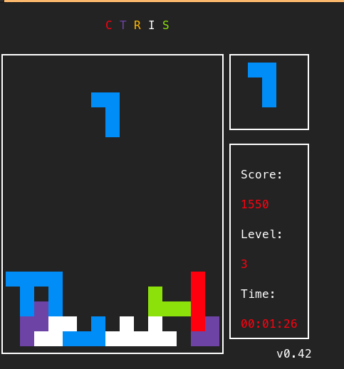

# Lab 8 - GPIOs, driver noyau et jeu vidéo

# Table des matières
- [Lab 8 - GPIOs, driver noyau et jeu vidéo](#lab-8---gpios-driver-noyau-et-jeu-vidéo)
- [Table des matières](#table-des-matières)
- [Instruction \& Description](#instruction--description)
- [Mise en place de la communication série avec la carte](#mise-en-place-de-la-communication-série-avec-la-carte)
  - [Branchements sur la carte](#branchements-sur-la-carte)
  - [Picocom](#picocom)
- [Laboratoire \& Questions](#laboratoire--questions)
  - [Préparation](#préparation)
  - [Pinout de la carte MyLab1](#pinout-de-la-carte-mylab1)
  - [Connection de la carte MyLab1 à la carte Sama5D3-Xplained](#connection-de-la-carte-mylab1-à-la-carte-sama5d3-xplained)
  - [Lecture du joystick via sysfs](#lecture-du-joystick-via-sysfs)
    - [Q1 - Expliquez l’implémentation de votre script permettant de lire l’état du joystick et indiquez où il se trouve sur votre git.](#q1---expliquez-limplémentation-de-votre-script-permettant-de-lire-létat-du-joystick-et-indiquez-où-il-se-trouve-sur-votre-git)
  - [Implémentation d’un driver noyau](#implémentation-dun-driver-noyau)
    - [Q2 - Expliquez le fonctionnement de votre module et les parties sensibles de son implémentation, en particulier comment vous gérez les états du joystick. Indiquez où se trouvent les sources de votre module ainsi que le Makefile correspondant sur votre git.](#q2---expliquez-le-fonctionnement-de-votre-module-et-les-parties-sensibles-de-son-implémentation-en-particulier-comment-vous-gérez-les-états-du-joystick-indiquez-où-se-trouvent-les-sources-de-votre-module-ainsi-que-le-makefile-correspondant-sur-votre-git)
  - [Utilisation du module depuis l’espace utilisateur](#utilisation-du-module-depuis-lespace-utilisateur)
    - [Q3 - Expliquez le fonctionnement de votre programme, notamment comment vous obtenez les états du joystick. Indiquez où se trouvent les sources du programme ainsi que le Makefile correspondant sur votre git.](#q3---expliquez-le-fonctionnement-de-votre-programme-notamment-comment-vous-obtenez-les-états-du-joystick-indiquez-où-se-trouvent-les-sources-du-programme-ainsi-que-le-makefile-correspondant-sur-votre-git)
  - [Compilation croisée de la librairie ncurses](#compilation-croisée-de-la-librairie-ncurses)
    - [Q4 - Quels répertoires avez-vous copiés ?](#q4---quels-répertoires-avez-vous-copiés-)
  - [Compilation croisée de CTRIS](#compilation-croisée-de-ctris)
  - [Exécution de CTRIS](#exécution-de-ctris)
    - [Q5 - Quelle est le type du terminal courant sur votre système embarqué ?](#q5---quelle-est-le-type-du-terminal-courant-sur-votre-système-embarqué-)
    - [Q6 - Quelle en est la raison à votre avis ?](#q6---quelle-en-est-la-raison-à-votre-avis-)
  - [Mise en place d’un serveur telnet](#mise-en-place-dun-serveur-telnet)
    - [Q7 - Que réalisent les différentes options ci-dessus (à expliquer avec vos propres mots, pas de copier/coller en anglais svp) ?](#q7---que-réalisent-les-différentes-options-ci-dessus-à-expliquer-avec-vos-propres-mots-pas-de-copiercoller-en-anglais-svp-)
    - [Q8 - Quels changements avez-vous effectués pour réaliser ceci ?](#q8---quels-changements-avez-vous-effectués-pour-réaliser-ceci-)
  - [Modification de CTRIS pour utiliser le joystick de la carte MyLab1](#modification-de-ctris-pour-utiliser-le-joystick-de-la-carte-mylab1)
    - [Q9 - Expliquez comment vous avez modifié le code de CTRIS afin que celui-ci utilise le joystick de votre carte MyLab1 et que le jeu reste jouable. Créez un patch avec le code complet de vos changements (en incluant le Makefile) et indiquez où il se trouve sur votre git.](#q9---expliquez-comment-vous-avez-modifié-le-code-de-ctris-afin-que-celui-ci-utilise-le-joystick-de-votre-carte-mylab1-et-que-le-jeu-reste-jouable-créez-un-patch-avec-le-code-complet-de-vos-changements-en-incluant-le-makefile-et-indiquez-où-il-se-trouve-sur-votre-git)
- [Creators](#creators)
- [Copyright and license](#copyright-and-license)

# Instruction & Description

[Lab8 - GPIOs, driver noyau et jeu vidéo](https://gitedu.hesge.ch/flg_courses/embedded_linux/embedd_linux_pub_fall23/-/blob/613ab55887a04981bfd83458707e30d826870450/labs/lab08-gpio_driver.pdf)

Le but de ce travail pratique est de commencer par vous familiariser avec la gestion des GPIOs sous Linux.
Ensuite, vous implémenterez un character driver permettant de lire la position du joystick de la carte MyLab1 via les GPIOs.
Vous développerez ensuite un programme de test permettant de valider le bon fonctionnement de votre module noyau.
Enfin, vous modifierez le code d’un petit jeu existant afin que celui-ci soit jouable avec le joystick de la carte MyLab1.

# Mise en place de la communication série avec la carte

## Branchements sur la carte

`TXD -> Blanc` 
`RXD -> Vert` 
`GND -> Noir` 
`X   -> Rouge`

## Picocom

`picocom -b 115200 /dev/ttyUSB0` 
L'utilisateur doit être dans le groupe `dialout` afin que cela fonctionne.

# Laboratoire & Questions

## Préparation

Nous devons premièrement nous assurer que notre `rootfs` fonctionne toujours en mode `NFS` pour cela nous allons tester l'entrée `Linux 6.1.56 - Network` de notre menu de boot de U-Boot :

~~~cmd
[ U-Boot -> Linux 6.1.56 - Network ]
[... Boot ...]
192.168.1.2 login: root
Password : 
Jan  1 00:02:02 login[104]: root login on 'ttyS0'
~ # ls
TEST_3.img  boot.img    home.img    root.img    rootfs.img  var.img
~~~

Tout est en place et nous pouvons confirmer que nous somme bien en `NFS` car les fichiers dans le répertoire root correspondent à ceux présent sur notre machine hôte.

## Pinout de la carte MyLab1

| **Fonction**    |  **Pin** |
| :-------------- | -------: |
| Joystick left   | CONN2.25 |
| Joystick right  | CONN1.27 |
| Joystick up     | CONN2.24 |
| Joystick down   | CONN2.26 |
| Joystick button | CONN2.23 |
| GND             |  CONN1.1 |
| 3V3             |  CONN2.1 |

## Connection de la carte MyLab1 à la carte Sama5D3-Xplained

Nous pouvons maintenant connecter les pins du joystick de la carte `MyLab1` à notre board comme suit :

| **Fonction**    | **MyLab1** | **Sama5D3** |
| :-------------- | :--------: | ----------: |
| Joystick left   |  CONN2.25  |        PA16 |
| Joystick right  |  CONN1.27  |        PA17 |
| Joystick up     |  CONN2.24  |        PA21 |
| Joystick down   |  CONN2.26  |        PA23 |
| Joystick button |  CONN2.23  |        PB15 |
| GND             |  CONN1.1   |         GND |
| 3V3             |  CONN2.1   |         3V3 |

## Lecture du joystick via sysfs

Dans un premier temps, nous allons exposer les GPIOs correspondants au joystick grâce au système de fichier `sysfs` et les configurer en lecture afin de vérifier que tout les boutons fonctionnes :

~~~cmd
/ # echo 16 > /sys/class/gpio/export
/ # echo 17 > /sys/class/gpio/export
/ # echo 21 > /sys/class/gpio/export
/ # echo 23 > /sys/class/gpio/export
/ # echo 47 > /sys/class/gpio/export
/ # echo in > /sys/class/gpio/pioA16/direction
/ # echo in > /sys/class/gpio/pioA17/direction
/ # echo in > /sys/class/gpio/pioA21/direction
/ # echo in > /sys/class/gpio/pioA23/direction
/ # echo in > /sys/class/gpio/pioB15/direction
~~~

Nous pouvons maintenant vérifier si tout fonctionne :

~~~cmd
/ # watch -n 1 "cat /sys/class/gpio/pioA16/value"
1
[... Joystick left pushed ...]
0
[... Joystick left released ...]
1
~~~
~~~cmd
/ # watch -n 1 "cat /sys/class/gpio/pioA17/value"
1
[... Joystick right pushed ...]
0
[... Joystick right released ...]
1
~~~
~~~cmd
/ # watch -n 1 "cat /sys/class/gpio/pioA21/value"
1
[... Joystick up pushed ...]
0
[... Joystick up released ...]
1
~~~
~~~cmd
/ # watch -n 1 "cat /sys/class/gpio/pioA23/value"
1
[... Joystick down pushed ...]
0
[... Joystick down released ...]
1
~~~
~~~cmd
/ # watch -n 1 "cat /sys/class/gpio/pioB15/value"
1
[... Joystick button pushed ...]
0
[... Joystick button released ...]
1
~~~

Tout fonctionne correctement. Nous pouvons donc maintenant créer un script afin de faire tout cela, plus l'unexport des GPIOs quand nous avons terminer :

~~~cmd
~ # trouch joystick.sh
~ # chmod +x joystick.sh
~ # vi joystick.sh
~~~

Et nous y mettons :

~~~bash
#!/bin/bash

unexport_gpio() {
	
	# Unexport Pins
	echo 16 > /sys/class/gpio/unexport
	echo 17 > /sys/class/gpio/unexport
	echo 21 > /sys/class/gpio/unexport
	echo 23 > /sys/class/gpio/unexport
	echo 47 > /sys/class/gpio/unexport
	
	exit 0
}

# Intercept CTRL+C
trap unexport_gpio INT

# Export Pins to make it accessible
echo 16 > /sys/class/gpio/export
echo 17 > /sys/class/gpio/export
echo 21 > /sys/class/gpio/export
echo 23 > /sys/class/gpio/export
echo 47 > /sys/class/gpio/export

# Configure the GPIOs in input
echo in > /sys/class/gpio/pioA16/direction
echo in > /sys/class/gpio/pioA17/direction
echo in > /sys/class/gpio/pioA21/direction
echo in > /sys/class/gpio/pioA23/direction
echo in > /sys/class/gpio/pioB15/direction

while [ 1 ]; do
	
	printf "\033c"
	printf "JoyStick :\n\n"
	
	printf "  "
	
	# Left
    if [ $(cat /sys/class/gpio/pioA16/value) -eq 0 ]; then
        printf "←"
    fi

	# Up
    if [ $(cat /sys/class/gpio/pioA21/value) -eq 0 ]; then
        printf "↑"
    fi

	# Down
    if [ $(cat /sys/class/gpio/pioA23/value) -eq 0 ]; then
        printf "↓"
    fi

	# Right
    if [ $(cat /sys/class/gpio/pioA17/value) -eq 0 ]; then
        printf "→"
    fi
	
	# Button
	if [ $(cat /sys/class/gpio/pioB15/value) -eq 0 ]; then
        printf "■"
    fi
	
	printf "\n\n"
	
	sleep 0.1
	
done
~~~

Nous pouvons maintenant tester le script et voir que tout fonctionne.

### Q1 - Expliquez l’implémentation de votre script permettant de lire l’état du joystick et indiquez où il se trouve sur votre git.

Mon implémentation est la suivante :

1. Créer l'interception pour le CTRL+C
   1. Lance la `fonction unexport_gpio` qui unexport les pins et quitte le programme
2. Export les pins pour les rendre accessibles
3. Configurer les GPIOs en mode input
4. Notre boucle infini
   1. Clear notre terminal
   2. Vérifier chaque gpio et voir si il est égale à 0
      1. Si c'est le cas : afficher le caractère ASCII correspondant à la direction du joystick
   3. Attendre 100 ms

Le script peut être trouvé  [ici](https://gitedu.hesge.ch/flg_courses/embedded_linux/students/michael.divia/-/blob/1e27dbf45f34784b2a0be57e125271f3684b95ef/lab_8/joystick.sh).

## Implémentation d’un driver noyau

Nous allons donc maintenant créer un module noyau d’un driver de type caractère permettant d’exposer les fonctionnalités du joystick de la carte MyLab1.
Afin de créer se module, nous allons créer le fichier `joystick_module.c` :

~~~C
#include <linux/module.h>
#include <linux/init.h>
#include <linux/kernel.h>
#include <linux/interrupt.h>
#include <linux/gpio.h>
#include <linux/fs.h>

#define DEVICE_NAME "joystick"
#define GPIO_LEFT 16
#define GPIO_RIGHT 17
#define GPIO_UP 21
#define GPIO_DOWN 23
#define GPIO_BUTTON 47

// Joystick states
enum
{
    JOYSTICK_NONE,
    JOYSTICK_LEFT,
    JOYSTICK_RIGHT,
    JOYSTICK_UP,
    JOYSTICK_DOWN,
    JOYSTICK_BUTTON
};

static int major;
static struct class *joystick_class;
struct device *joystick_device;

static int joystick_state;

// Operation prototypes
static ssize_t dev_read(struct file *, char __user *, size_t, loff_t *);
static irqreturn_t joystick_irq_handler(int, void *);

// The driver's file operations
static struct file_operations fops = {
    .owner = THIS_MODULE,
    .read = dev_read,
};

/**
 * Driver initialization code.
 */
static int __init joystick_dev_init(void)
{
    int result;

    // 1) Register the device by dynamically obtaining a major number
    result = register_chrdev(0, DEVICE_NAME, &fops);
    if (result < 0)
    {
        pr_err("Failed to allocate major number\n");
        return result;
    }
    major = result;

    // 2) Create the class
    joystick_class = class_create(THIS_MODULE, DEVICE_NAME);
    if (IS_ERR(joystick_class))
    {
        pr_err("Failed to create class\n");
        unregister_chrdev(major, DEVICE_NAME);
        return PTR_ERR(joystick_class);
    }

    // 3) Create the device in /dev
    joystick_device = device_create(joystick_class, NULL, MKDEV(major, 0), NULL, "JoyStick");
    if (IS_ERR(joystick_device))
    {
        pr_err("Failed to add cdev\n");
        class_destroy(joystick_class);
        unregister_chrdev(major, DEVICE_NAME);
        return result;
    }

    // 6) Request the necessary GPIOs
    result = gpio_request(GPIO_LEFT, "joystick_left");
    if (result < 0)
    {
        pr_err("Failed to request GPIO_LEFT\n");
        goto err_gpio;
    }

    result = gpio_request(GPIO_RIGHT, "joystick_right");
    if (result < 0)
    {
        pr_err("Failed to request GPIO_RIGHT\n");
        goto err_gpio;
    }

    result = gpio_request(GPIO_UP, "joystick_up");
    if (result < 0)
    {
        pr_err("Failed to request GPIO_UP\n");
        goto err_gpio;
    }

    result = gpio_request(GPIO_DOWN, "joystick_down");
    if (result < 0)
    {
        pr_err("Failed to request GPIO_DOWN\n");
        goto err_gpio;
    }

    result = gpio_request(GPIO_BUTTON, "joystick_button");
    if (result < 0)
    {
        pr_err("Failed to request GPIO_BUTTON\n");
        goto err_gpio;
    }

    // 7) Register an IRQ handler per GPIO
    result = request_irq(gpio_to_irq(GPIO_LEFT), joystick_irq_handler, IRQF_TRIGGER_FALLING | IRQF_TRIGGER_RISING, "joystick_left", NULL);
    if (result < 0)
    {
        pr_err("Failed to request IRQ for GPIO_LEFT\n");
        goto err_irq_left;
    }

    result = request_irq(gpio_to_irq(GPIO_RIGHT), joystick_irq_handler, IRQF_TRIGGER_FALLING | IRQF_TRIGGER_RISING, "joystick_right", NULL);
    if (result < 0)
    {
        pr_err("Failed to request IRQ for GPIO_RIGHT\n");
        goto err_irq_right;
    }

    result = request_irq(gpio_to_irq(GPIO_UP), joystick_irq_handler, IRQF_TRIGGER_FALLING | IRQF_TRIGGER_RISING, "joystick_up", NULL);
    if (result < 0)
    {
        pr_err("Failed to request IRQ for GPIO_UP\n");
        goto err_irq_up;
    }

    result = request_irq(gpio_to_irq(GPIO_DOWN), joystick_irq_handler, IRQF_TRIGGER_FALLING | IRQF_TRIGGER_RISING, "joystick_down", NULL);
    if (result < 0)
    {
        pr_err("Failed to request IRQ for GPIO_DOWN\n");
        goto err_irq_down;
    }

    result = request_irq(gpio_to_irq(GPIO_BUTTON), joystick_irq_handler, IRQF_TRIGGER_FALLING | IRQF_TRIGGER_RISING, "joystick_button", NULL);
    if (result < 0)
    {
        pr_err("Failed to request IRQ for GPIO_button\n");
        goto err_irq_button;
    }

    pr_info("Joystick driver initialized\n");
    return 0;

err_irq_left:
    // Free GPIO
    gpio_free(GPIO_LEFT);
err_irq_right:
    // Free GPIO
    gpio_free(GPIO_RIGHT);
err_irq_up:
    // Free GPIO
    gpio_free(GPIO_UP);
err_irq_down:
    // Free GPIO
    gpio_free(GPIO_DOWN);
err_irq_button:
    // Free GPIO
    gpio_free(GPIO_BUTTON);
err_gpio:
    // Destroy Device
    device_destroy(joystick_class, MKDEV(major, 0));
    // Unregister class
    class_destroy(joystick_class);
    // Unregister major number
    unregister_chrdev(major, DEVICE_NAME);
    return result;
}

/**
 * This function is called when the module is unloaded.
 */
static void __exit joystick_dev_exit(void)
{
    // 1) Destroy the device
    device_destroy(joystick_class, MKDEV(major, 0));

    // 2) Destroy the class
    class_destroy(joystick_class);

    // 4) Unregister the device
    unregister_chrdev(major, DEVICE_NAME);

    // 5) Free the IRQs
    free_irq(gpio_to_irq(GPIO_LEFT), NULL);
    free_irq(gpio_to_irq(GPIO_RIGHT), NULL);
    free_irq(gpio_to_irq(GPIO_UP), NULL);
    free_irq(gpio_to_irq(GPIO_DOWN), NULL);
    free_irq(gpio_to_irq(GPIO_BUTTON), NULL);

    // 6) Free the GPIOs
    gpio_free(GPIO_LEFT);
    gpio_free(GPIO_RIGHT);
    gpio_free(GPIO_UP);
    gpio_free(GPIO_DOWN);
    gpio_free(GPIO_BUTTON);

    pr_info("Joystick driver destroyed\n");
}

/**
 * Read operation
 */
static ssize_t dev_read(struct file *f, char __user *buf, size_t len, loff_t *off)
{
    size_t bytes_to_copy = min(len, sizeof(joystick_state));

    if (copy_to_user(buf, &joystick_state, bytes_to_copy))
    {
        return -EFAULT;
    }

    // Number of bytes successfully copied
    return bytes_to_copy;
}

/**
 * Joystick IRQ handler
 */
static irqreturn_t joystick_irq_handler(int irq, void *dev_id)
{
    // Determine which GPIO triggered the interrupt
    if (irq == gpio_to_irq(GPIO_LEFT))
    {
        int state = gpio_get_value(GPIO_LEFT);
        if (state == 0)
        {
            joystick_state = JOYSTICK_LEFT;
        }
        else if (state == 1)
        {
            joystick_state = JOYSTICK_NONE;
        }
    }
    else if (irq == gpio_to_irq(GPIO_RIGHT))
    {
        int state = gpio_get_value(GPIO_RIGHT);
        if (state == 0)
        {
            joystick_state = JOYSTICK_RIGHT;
        }
        else if (state == 1)
        {
            joystick_state = JOYSTICK_NONE;
        }
    }
    else if (irq == gpio_to_irq(GPIO_UP))
    {
        int state = gpio_get_value(GPIO_UP);
        if (state == 0)
        {
            joystick_state = JOYSTICK_UP;
        }
        else if (state == 1)
        {
            joystick_state = JOYSTICK_NONE;
        }
    }
    else if (irq == gpio_to_irq(GPIO_DOWN))
    {
        int state = gpio_get_value(GPIO_DOWN);
        if (state == 0)
        {
            joystick_state = JOYSTICK_DOWN;
        }
        else if (state == 1)
        {
            joystick_state = JOYSTICK_NONE;
        }
    }
    else if (irq == gpio_to_irq(GPIO_BUTTON))
    {
        int state = gpio_get_value(GPIO_BUTTON);
        if (state == 0)
        {
            joystick_state = JOYSTICK_BUTTON;
        }
        else if (state == 1)
        {
            joystick_state = JOYSTICK_NONE;
        }
    }

    // Notify user-space about the state change
    // pr_info("Joystick state changed: %d\n", joystick_state);

    // Announce that the IRQ has been handled correctly
    return IRQ_HANDLED;
}

module_init(joystick_dev_init);
module_exit(joystick_dev_exit);

MODULE_LICENSE("GPL");
MODULE_AUTHOR("Michael Divià <michael.divia@gmail.com>");
MODULE_DESCRIPTION("Joystick driver");
MODULE_VERSION("0.1");
~~~

Ainsi qu'un `Makefile` pour le compiler :

~~~Makefile
# Path to kernel headers
KDIR := "../kernel/linux-6.1.56"

# Our module's name (source is joystick_module.c)
obj-m := joystick_module.o

modules:
	$(MAKE) -C $(KDIR) M=$(PWD) modules

clean:
	$(MAKE) -C $(KDIR) M=$(PWD) clean
~~~

Une fois créer, nous pouvons compiler notre module et le rajouter dans notre `nfsroot` :

~~~cmd
❯ make ARCH=arm CROSS_COMPILE=arm-linux-
make -C "../kernel/linux-6.1.56" M=/home/padi/Git/linux_embarq/michael.divia/module modules
make[1] : on entre dans le répertoire « /home/padi/Git/linux_embarq/michael.divia/kernel/linux-6.1.56 »
  CC [M]  /home/padi/Git/linux_embarq/michael.divia/module/joystick_module.o
  MODPOST /home/padi/Git/linux_embarq/michael.divia/module/Module.symvers
  CC [M]  /home/padi/Git/linux_embarq/michael.divia/module/joystick_module.mod.o
  LD [M]  /home/padi/Git/linux_embarq/michael.divia/module/joystick_module.ko
make[1] : on quitte le répertoire « /home/padi/Git/linux_embarq/michael.divia/kernel/linux-6.1.56 »
❯ sudo mkdir ../nfsroot/lib/modules/6.1.56/kernel/drivers/joystick
❯ sudo cp joystick_module.ko ../nfsroot/lib/modules/6.1.56/kernel/drivers/joystick/
~~~

Afin de tester notre module, il nous faut le charger depuis notre board:

~~~cmd
~ # cd /lib/modules/6.1.56/kernel/drivers/joystick/
/lib/modules/6.1.56/kernel/drivers/joystick # insmod joystick_module.ko
joystick_module: loading out-of-tree module taints kernel.
Joystick driver initialized
~~~

Le driver à bien été initialiser, nous pouvons tester son bon fonctionnement, sois en décommentant `pr_info("Joystick state changed: %d\n", joystick_state);`, sois en vérifiant le contenu du fichier `/dev/Joystick`.

Au repos :
~~~cmd
~ # hexdump -C /dev/JoyStick
Joystick device opened
00000000  00 00 00 00                                       |....|
00000004
~~~
Vers le haut :
~~~cmd
~ # hexdump -C /dev/JoyStick
Joystick device opened
00000000  03 00 00 00                                       |....|
00000004
~~~
Vers le bas :
~~~cmd
~ # hexdump -C /dev/JoyStick
Joystick device opened
00000000  04 00 00 00                                       |....|
00000004
~~~
Vers la gauche :
~~~cmd
~ # hexdump -C /dev/JoyStick
Joystick device opened
00000000  01 00 00 00                                       |....|
00000004
~~~
Vers la droite :
~~~cmd
~ # hexdump -C /dev/JoyStick
Joystick device opened
00000000  02 00 00 00                                       |....|
00000004
~~~
Et le bouton :
~~~cmd
~ # hexdump -C /dev/JoyStick
Joystick device opened
00000000  05 00 00 00                                       |....|
00000004
~~~

Nous allons finalement tester notre module pour voir se qu'il se passe si nous essayons de le lancer alors qu'un GPIO est déjà utiliser :

~~~cmd
~ # echo 16 > /sys/class/gpio/export
~ # echo in > /sys/class/gpio/pioA16/direction
~ # insmod /lib/modules/6.1.56/kernel/drivers/joystick/joystick_module.ko 
joystick_module: loading out-of-tree module taints kernel.
Failed to request GPIO_LEFT
insmod: can't insert '/lib/modules/6.1.56/kernel/drivers/joystick/joystick_module.ko': Device or resource busy
~~~

### Q2 - Expliquez le fonctionnement de votre module et les parties sensibles de son implémentation, en particulier comment vous gérez les états du joystick. Indiquez où se trouvent les sources de votre module ainsi que le Makefile correspondant sur votre git.

Voici une explication du fonctionnement du fonctionnement de mon module :

- Initialisation du module :
	- Le module commence par inclure les en-têtes nécessaires, définir des constantes telles que le nom du périphérique (`DEVICE_NAME`) et les numéros de GPIO associés à chaque direction du joystick et au bouton.
	- Il définit également des états du joystick sous la forme d'une énumération.

- Enregistrement du périphérique :
	- La fonction `joystick_dev_init` est responsable de l'initialisation du module. Elle commence par enregistrer le périphérique avec la fonction register_chrdev, qui attribue dynamiquement un numéro majeur au pilote. Si cette étape échoue, le module est désenregistré et une erreur est renvoyée.
	- Ensuite, une classe de périphériques est créée avec `class_create` et un périphérique est créé avec `device_create`.
	- Les GPIO nécessaires sont demandés avec `gpio_request`.
	- Les interruptions (IRQ) sont enregistrées pour chaque GPIO associé à une direction du joystick et au bouton avec `request_irq`.

- Gestion des interruptions :
	- La fonction `joystick_irq_handler` est appelée lorsqu'une interruption se produit sur l'un des GPIO. Cette fonction utilise `gpio_get_value` pour déterminer l'état actuel du GPIO, indiquant si le joystick a été activé ou désactivé.
	- En fonction de l'IRQ déclenchée, l'état du joystick est mis à jour en conséquence, soit l'une des directions, soit le bouton, soit aucun (JOYSTICK_NONE).
	- L'état du joystick est stocké dans la variable `joystick_state`.

- Lecture du périphérique :
  - Lorsqu'un utilisateur lit à partir du périphérique avec la fonction `dev_read`, l'état actuel du joystick (`joystick_state`) est renvoyé à l'utilisateur. Cela se fait en utilisant `copy_to_user`.
  
- Libération des ressources lors de la désinstallation :
  - La fonction `joystick_dev_exit` est responsable de la désinstallation du module. Elle libère toutes les ressources allouées, y compris les GPIO et les IRQ.
  - Elle détruit le périphérique, la classe de périphériques, et désenregistre le périphérique avec `unregister_chrdev`.
  
- Gestion des erreurs :
  - En cas d'échec lors de la demande de ressources (GPIO, IRQ), le code utilise des étiquettes (`err_gpio`, `err_irq_left`, etc.) pour sauter aux parties appropriées du code de nettoyage.
  - Les ressources sont libérées dans l'ordre inverse de leur allocation.
  
- Informations du module :
  - Le module fournit des informations de licence, d'auteur, de description et de version.
  
De plus, nous gérons le chargement et déchargement comme suit :

- Chargement correct du module :
	- Lors du chargement du module (`joystick_dev_init`), différentes étapes sont effectuées pour allouer les ressources nécessaires telles que le numéro majeur, la classe de périphériques, les GPIOs et les gestionnaires d'interruption.
	- Des vérifications sont effectuées après chaque étape, et en cas d'échec, des mesures appropriées sont prises pour libérer les ressources déjà allouées.

- Déchargement correct du module :
	- Lors du déchargement du module (`joystick_dev_exit`), des fonctions sont appelées pour libérer les ressources allouées, y compris la destruction du périphérique de caractères, de la classe de périphériques, la libération des GPIOs et des gestionnaires d'interruption.
	- La libération des ressources est faite de manière ordonnée et sans erreurs apparentes.

- Gestion des erreurs lors de l'occupation des GPIOs :
	- En cas d'échec lors de la demande des GPIOs (`gpio_request`), le code saute vers une étiquette d'erreur (`err_gpio`), où toutes les ressources déjà allouées sont correctement libérées avant de renvoyer l'erreur.
	- La libération des GPIOs et des gestionnaires d'interruption est correctement gérée dans la section `err_irq_*` en cas d'échec lors de la demande d'interruption.

- Aucune erreur du noyau pendant le chargement ou le déchargement :
	- Les ressources sont libérées correctement même en cas d'échec, ce qui garantit que le chargement ou le déchargement du module n'entraîne pas d'erreur du noyau.

Le module et le `Makefile` peuvent être trouvé [ici](https://gitedu.hesge.ch/flg_courses/embedded_linux/students/michael.divia/-/tree/master/module).

## Utilisation du module depuis l’espace utilisateur

Nous allons maintenant tester notre modules dans un cas plus pratique : dans un programme. Nous allons donc créer un programme en C qui affiche simplement l’état du joystick en temps réel et qui se termine lorsque le bouton du joystick est pressé.

Voici le code de notre programme :

~~~C
#include <stdio.h>
#include <fcntl.h>
#include <unistd.h>
#include <stdint.h>

#define JOYSTICK_DEVICE "/dev/JoyStick"

int main()
{
    // Open Joystick in Read Only Mode
    int fd = open(JOYSTICK_DEVICE, O_RDWR | O_SYNC);

    // Check if everything went well
    if (fd == -1)
    {
        perror("Error opening joystick device");
        return -1;
    }

    int joystick_state;

    while (1)
    {
        // Read the Joystick state in the kernel module
        ssize_t count = read(fd, &joystick_state, sizeof(joystick_state));

        if (count == -1)
        {
            perror("Error reading joystick state");
            break;
        }

        // If a joystick is pushed, show it's state
        if (joystick_state != 0)
        {
            switch (joystick_state)
            {
            case 1:
                printf("Joystick Left\n");
                break;
            case 2:
                printf("Joystick Right\n");
                break;
            case 3:
                printf("Joystick Up\n");
                break;
            case 4:
                printf("Joystick Down\n");
                break;
            case 5:
                printf("Joystick Button Pressed\n");

                // Close the program
                close(fd);
                return 0;
            }
        }

        // usleep to prevent saturation of the CPU
        usleep(10000);
    }
}
~~~

et notre `Makefile` :

~~~Makefile
CC = arm-linux-gcc
CFLAGS = -Wall

joystick_reader: joystick_reader.c
	$(CC) $(CFLAGS) -o $@ $^

clean:
	rm -f joystick_reader
~~~

Nous pouvons maintenant compiler notre programme et l'envoyer sur notre board :

~~~cmd
❯ make
arm-linux-gcc -Wall -o joystick_reader joystick_reader.c
❯ sudo cp joystick_reader ../nfsroot/root/
~~~

Puis le lancer sur notre board :

~~~cmd
~ # ./joystick_reader
[... Rien n'est appuyé ...]
Joystick Right
Joystick Right
Joystick Right
Joystick Right
Joystick Right
Joystick Right
Joystick Right
Joystick Down
Joystick Down
Joystick Down
[... Rien n'est appuyé ...]
Joystick Button Pressed
~~~

Tout fonctionne comme prévu.

### Q3 - Expliquez le fonctionnement de votre programme, notamment comment vous obtenez les états du joystick. Indiquez où se trouvent les sources du programme ainsi que le Makefile correspondant sur votre git.

- Ouverture du fichier `/dev/JoyStick` :
    - La première étape est l'ouverture du fichier `/dev/JoyStick` en mode lecture et écriture synchrone (`O_RDWR | O_SYNC`). Cela crée un descripteur de fichier (`fd`) qui peut être utilisé pour lire et écrire dans le fichier.

- Boucle de lecture :
    - Ensuite, le programme entre dans une boucle infinie (`while (1)`) qui surveille en continu l'état du joystick.

- Lecture de l'état du joystick :
    - La fonction `read` est utilisée pour lire l'état du joystick à partir du fichier `/dev/JoyStick`. La valeur lue est stockée dans la variable `joystick_state`.

- Affichage de l'état du joystick :
    - En fonction de la valeur de `joystick_state`, le programme affiche l'état actuel du joystick sur la console. Si un bouton est enfoncé, le programme affiche le message correspondant à la direction ou au bouton appuyé.

- Fermeture du programme :
    - Si le bouton du joystick est pressé (valeur 5), le programme affiche le message "Joystick Button Pressed" et ferme le fichier `/dev/JoyStick` en appelant la fonction close. Ensuite, le programme se termine avec un code de retour 0.

- Pause pour éviter la saturation CPU :
    - Entre chaque itération de la boucle, le programme utilise la fonction `usleep` pour faire une pause de 10'000 microsecondes (10 millisecondes). Cela permet d'éviter la saturation du CPU en réduisant la fréquence des lectures de l'état du joystick.

Le code du programme et le `Makefile` peuvent être trouvé respectivement [ici](https://gitedu.hesge.ch/flg_courses/embedded_linux/students/michael.divia/-/blob/adb43ef8d1c3f021e377e839e6e432233a7a9984/lab_8/joystick_reader.c) et [ici](https://gitedu.hesge.ch/flg_courses/embedded_linux/students/michael.divia/-/blob/adb43ef8d1c3f021e377e839e6e432233a7a9984/lab_8/Makefile).

## Compilation croisée de la librairie ncurses

Le jeux que nous voulons modifier est CTRIS, une version console (texte) du fameux jeu Tetris.CTRIS nécessite la librairie ncurses qui est une librairie permettant de gérer l’affichage dans un terminal. Comme cette librairie ne fait pas partie de la chaîne de compilation croisée ou de Busybox, il est nécessaire de la compiler pour la plateforme Sama5D3.

Nous allons donc télécharger la version 6.2 de ncurses [ici](https://invisible-island.net/archives/ncurses/ncurses-6.2.tar.gz), le décompresser et le compiler :

~~~cmd
❯ mkdir ncurses
❯ cd ncurses
❯ wget https://invisible-island.net/archives/ncurses/ncurses-6.2.tar.gz
--2024-01-17 00:41:43--  https://invisible-island.net/archives/ncurses/ncurses-6.2.tar.gz
Résolution de invisible-island.net (invisible-island.net)… 192.124.249.12
Connexion à invisible-island.net (invisible-island.net)|192.124.249.12|:443… connecté.
requête HTTP transmise, en attente de la réponse… 200 OK
Taille : 3425862 (3.3M) [application/x-gzip]
Enregistre : ‘ncurses-6.2.tar.gz’

ncurses-6.2.tar.gz                              100%[=====================================================================================================>]   3.27M  1.77MB/s    ds 1.8s    

2024-01-17 00:41:46 (1.77 MB/s) - ‘ncurses-6.2.tar.gz’ enregistré [3425862/3425862]
❯ tar -xvzf ncurses-6.2.tar.gz
❯ rm ncurses-6.2.tar.gz
❯ cd ncurses-6.2
❯ export CC=arm-linux-gcc
❯ ./configure --host=arm-linux --prefix=/usr --without-progs --with-shared
[... Configuration de ncurses ...]
❯ make
[... Compilation de ncurses ...]
❯ make DESTDIR=/home/padi/Git/linux_embarq/michael.divia/ncurses/staging install
❯ cd ../staging/usr
❯ ls
bin  include  lib  share
~~~

Nous allons maintenant copier les dossier er fichier utile sur notre `nfsroot` :

~~~cmd
❯ sudo mkdir ../../../nfsroot/usr/lib
❯ sudo cp -a lib/*.so* ../../../nfsroot/usr/lib
❯ sudo cp -a share ../../../nfsroot/usr/
~~~

### Q4 - Quels répertoires avez-vous copiés ?

Nous avons copier l’entièreté du dossier `share` qui contient les sous-répertoires `tabset` et `terminfo` utilisés par la librairie ncurses, ainsi que les fichier `*.so*` dans le répertoire `lib` qui sont les librairies `libncurses` en version dynamique, nécessaire pour exécuter tout binaire nécessitant la librairies ncurses.

## Compilation croisée de CTRIS

La prochaine étape est donc de compiler notre jeu, CTRIS. Pour se faire nous allons commencer par obtenir le code source du jeu [ici](https://github.com/dominikhackl/ctris.git).

~~~cmd
❯ git clone https://github.com/dominikhackl/ctris.git
Clonage dans 'ctris'...
remote : Enumerating objects: 43, done.
remote : Counting objects: 100% (5/5), done.
remote : Compressing objects: 100% (5/5), done.
remote : Total 43 (delta 0), reused 2 (delta 0), pack-reused 38
Réception d'objets : 100% (43/43), 22.47 Kio | 719.00 Kio/s, fait.
Résolution des deltas : 100% (13/13), fait.
❯ cd ctris
❯ ls
AUTHORS  brick.h   COPYING           ctris.6.gz  ctris.h  game.h       highscore.h  LICENSE   README    screen.h
brick.c  colors.h  create_config.sh  ctris.c     game.c   highscore.c  INSTALL      Makefile  screen.c  TODO
~~~

Nous allons devoir modifier le fichier `Makefile` afin qu'il puisse compiler correctement le jeu :

~~~cmd
❯ nano Makefile
~~~

~~~Makefile
MANDIR=$(DESTDIR)/usr/share/man/man6/
BINDIR=$(DESTDIR)/usr/games/

CC=arm-linux-gcc
MKDIR=mkdir -p
INSTALL=install

CFLAGS=-Wall -fomit-frame-pointer -O3 -I /home/padi/Git/linux_embarq/michael.divia/ncurses/staging/usr/include/ 
LIBS=-L /home/padi/Git/linux_embarq/michael.divia/ncurses/staging/usr/lib -lm -lncurses

OBJS=ctris.o game.o screen.o brick.o highscore.o
OUTPUT=ctris
MANS=ctris.6.gz

[... Suite du Makefile ...]
~~~

Nous pouvons maintenant compiler le jeu et l'envoyé sur notre board :

~~~cmd
❯ make
[... Compilation ...]
❯ sudo cp ctris ../nfsroot/root/
~~~

## Exécution de CTRIS

CTRIS ne fonctionne pas encore, comme nous pouvons le voir si nous essayons de le lancer depuis notre board :

~~~cmd
~ # ./ctris
ERROR, your terminal can't display colors.
~~~

Ceci vient du fait que le terminal courant n’est pas configuré pour gérer les couleurs.

### Q5 - Quelle est le type du terminal courant sur votre système embarqué ?

~~~cmd
~ # echo $TERM
vt102
~~~

le `VT102` est un modèle de terminal produit par Digital Equipment Corporation (DEC) dans les années 1970 et 1980. D'origine, il ne supporte pas la couleur. Le modèle `VT102` était un terminal monochrome, ce qui signifie qu'il peut afficher des informations en noir et blanc. 
Il n'avait donc pas la capacité d'afficher des couleurs.

Nous allons donc devoir modifier notre type de terminal pour qu'il soit, à présent, de type `linux`.

~~~cmd
~ # echo "export TERM=linux" >> ~/.profile
~ # source ~/.profile
~ # echo $TERM
linux
~~~

Nous pouvons maintenant re-tester CTRIS :

~~~cmd
~ # ./ctris
~~~

### Q6 - Quelle en est la raison à votre avis ?

Le problème de saccades ou d'affichage non fluide lors de l'utilisation d'une connexion série via des programmes comme picocom peut être causé par plusieurs facteurs :

- Débit de transmission (Baud Rate)
- Surcharge du port série
- Tampons série pleins
- Latence système 
- Paramètres de picocom

## Mise en place d’un serveur telnet

Afin de remplacer la connexion via le port série, nous allons mettre en place un serveur `telnet` sur notre board.

Commençons par vérifier si `telnet` est présent sur notre board :

~~~cmd
~ # telnetd --help
BusyBox v1.34.1 (2023-11-09 17:08:12 CET) multi-call binary.

Usage : telnetd [OPTIONS]

Handle incoming telnet connections

	-l LOGIN	Exec LOGIN on connect
	-f ISSUE_FILE	Display ISSUE_FILE instead of /etc/issue
	-K		Close connection as soon as login exits
			(normally wait until all programs close slave pty)
	-p PORT		Port to listen on
	-b ADDR[:PORT]	Address to bind to
	-F		Run in foreground
	-i		Inetd mode
	-w SEC		Inetd 'wait' mode, linger time SEC
		inetd.conf line: 23 stream tcp wait root telnetd telnetd -w10
	-S		Log to syslog (implied by -i or without -F and -w)
~~~

`telnet` est bien présent, nous pouvons donc lancer le serveur :

~~~cmd
~ # telnetd -F -l sh
~~~

### Q7 - Que réalisent les différentes options ci-dessus (à expliquer avec vos propres mots, pas de copier/coller en anglais svp) ?

`-F` cette option spécifie de ne pas exécuter le service de démon en arrière-plan. Le serveur Telnet ne fonctionnera pas en tant que service persistant, mais il sera associé à la session actuelle du terminal.

`-l sh` cette option spécifie le programme shell (sh) qui sera exécuté pour la session Telnet. Lorsqu'un client Telnet se connecte, il obtiendra donc un shell interactif (sh).

Nous pouvons maintenant tester la connexion depuis notre machine hôte :

~~~cmd
❯ telnet 192.168.1.2
Trying 192.168.1.2...
Connected to 192.168.1.2.
Escape character is '^]'.
Connection closed by foreign host.
~~~

et nous voyons sur notre board :

~~~cmd
~ # telnetd -F -l sh

telnetd : can't find free pty
~ # 
~~~

La solution est de monter le système de fichiers virtuel pty.

~~~cmd
/ # mkdir /dev/pts
/ # mount -t devpts devpts /dev/pts
~~~

Si nous testons a nouveau, la connexion `telnet` fonctionne.

Finalement, nous voulons qe `telnet` démmare automatiquement au démmarage :

~~~cmd
/ # touch /etc/init.d/S14telnet
/ # chmod +x /etc/init.d/S14telnet
/ # vi /etc/init.d/S14telnet
~~~

Dans lequel nous mettons :

~~~bash
#!/bin/sh
#
# Start the telnet server                           
#

mkdir /dev/pts 
mount -t devpts devpts /dev/pts
telnetd -F -l sh              
~~~

Nous allons ensuite inverser `bootmenu_0` et `bootmenu_1`, qui était respectivement `Linux 6.1.56 - NAND` et `Linux 6.1.56 - Network` afin de rendre l'option `Linux 6.1.56 - Network` celle par défault. Ceci nous permet de ne plus devoir nous connecter er serie à notre board à l'avenir.

Après un reboot nous pouvons directement nous connecter en `telnet` depuis notre machine hote :

~~~cmd
❯ telnet 192.168.1.2
Trying 192.168.1.2...
Connected to 192.168.1.2.
Escape character is '^]'.

/ # 
~~~

### Q8 - Quels changements avez-vous effectués pour réaliser ceci ?

Nous avons créer un nouveau service (scipt) appelé `S14telnet` qui éffectue les actions suivantes :

- Crée le répertoire `/dev/pts` s'il n'existe pas déjà.
- Monte le système de fichiers des pseudoterminaux (`devpts`) sur le répertoire `/dev/pts`.
- Démarre le serveur `telnet` avec certaines options que nous avons détaillées précédemment.

## Modification de CTRIS pour utiliser le joystick de la carte MyLab1

Pour terminer, nous allons créer une API et modifier le code source du je CTRIS afin qu'il puisse l'utiliser.

Commençons avec notre API. Pour cela nous allons créer 2 fichiers :

joystick_API.h
~~~C
#ifndef JOYSTICK_API_H
#define JOYSTICK_API_H

#include <stdio.h>
#include <fcntl.h>
#include <unistd.h>
#include <stdint.h>

int get_joystick();

#endif
~~~

joystick_API.c
~~~C
#include "joystick_api.h"

#define JOYSTICK_DEVICE "/dev/JoyStick"
#define DELAY_INPUT 40

int get_joystick()
{

    static int cpt = 0;
    static int old_state = 0;

    // Open Joystick
    int fd = open(JOYSTICK_DEVICE, O_RDWR | O_SYNC);

    // Check if everything went well
    if (fd == -1)
    {
        perror("Error opening joystick device");
        return -1;
    }

    int joystick_state;

    // Read the Joystick state in the kernel module
    ssize_t count = read(fd, &joystick_state, sizeof(joystick_state));

    if (count == -1)
    {
        perror("Error reading joystick state");
        close(fd);
        return -1;
    }

    if (joystick_state == old_state)
    {
        if (cpt < DELAY_INPUT)
        {
            cpt++;

            close(fd);

            return 0;
        }
        else
        {
            old_state = joystick_state;
            cpt = 0;

            close(fd);

            return joystick_state;
        }
    }
    else
    {
        old_state = joystick_state;
        cpt = 0;

        close(fd);

        return joystick_state;
    }
}
~~~

Il ne nous reste plus qu'à inclure notre API dans CTRIS et de modifier le `Makefile` de ce dernier :

Dans screen.c :

~~~C
#include "ctris.h"
#include "screen.h"
#include "brick.h"
#include "colors.h"
#include "highscore.h"
#include "joystick_api.h"

[...]

int get_key(WINDOW *win)
{
	int joystick = get_joystick();
    
	if (joystick != 0)
	{
		int val = joystick;
		emulated_key = 0;
		return val;
	}
	if (emulated_key != 0)
	{
		int val = emulated_key;
		emulated_key = 0;
		return val;
	}

	return wgetch(win);
}

[...]
~~~

Dans game.c :

~~~C
[...]

switch (get_key(board_win))
{
    case 4:
    case 's':
    case KEY_DOWN:
        if (old_style_keys != 0)
        {
            if (counterclockwise_rotation == 1)
            {
                change_direction(board, cur_brick, x, y, -1);
            }
            else
            {
                change_direction(board, cur_brick, x, y, 1);
            }
        }
        else
        {
            if (check_brick(board, cur_brick, x, y + 1) == 0)
            {
                y++;
            }
        }
        break;
    case 3:
    case 'w':
    case 'k':
    case KEY_UP:
        if (counterclockwise_rotation == 1)
        {
            change_direction(board, cur_brick, x, y, 1);
        }
        else
        {
            change_direction(board, cur_brick, x, y, -1);
        }
        break;
    case 2:
    case 'd':
    case 'l':
    case KEY_RIGHT:
        if (check_brick(board, cur_brick, x + 1, y) == 0)
        {
            x++;
        }
        break;
    case 1:
    case 'a':
    case 'j':
    case KEY_LEFT:
        if (x > 0 && check_brick(board, cur_brick, x - 1, y) == 0)
        {
            x--;
        }
        break;
    case 5:
    case ' ':
        if (old_style_keys != 0)
        {
            if (check_brick(board, cur_brick, x, y + 1) == 0)
            {
                y++;
            }
        }
        else
        {
            while (check_brick(board, cur_brick, x, y + 1) == 0)
            {
                y++;
            }
        }
        break;
    case 'p':
        game_state = PAUSED_STATE;
        show_pause(board_win);
        while (old_get_key(board_win) != 'p')
            ;
        game_state = RUNNING_STATE;
        break;
    case 'q':
        game_state = QUIT_STATE;
        break;
}

[...]
~~~

Et le `Makefile` :

~~~Makefile

MANDIR=$(DESTDIR)/usr/share/man/man6/
BINDIR=$(DESTDIR)/usr/games/

CC=arm-linux-gcc
MKDIR=mkdir -p
INSTALL=install

CFLAGS=-Wall -fomit-frame-pointer -O3 -I /home/padi/Git/linux_embarq/michael.divia/ncurses/staging/usr/include/
LIBS=-L /home/padi/Git/linux_embarq/michael.divia/ncurses/staging/usr/lib -lm -lncurses

OBJS=ctris.o game.o screen.o brick.o highscore.o joystick_api.o
OUTPUT=ctris
MANS=ctris.6.gz

[...]
~~~

### Q9 - Expliquez comment vous avez modifié le code de CTRIS afin que celui-ci utilise le joystick de votre carte MyLab1 et que le jeu reste jouable. Créez un patch avec le code complet de vos changements (en incluant le Makefile) et indiquez où il se trouve sur votre git.

La modification apportée a CTRIS sont les suivante :

1. Dans le fichier `game.c`, le `case swtich` a été modifier afin de prendre en charge, en plus des input du clavier, des ints.
2. Dans le fichier `screen.c`, la fonction `get_key` a été modifier afin de d'abord appelé l'API du joystick puis, si le joystick ne donne pas d'input, de prendre les inputs clavier.

Il ne nous reste plus qu'à créer notre patch et à l'appliquer sur notre CTRIS :

~~~cmd
❯ cd ctris_joystick_api
❯ git diff > ctris_joystick.patch
❯ mv ctris_joystick.patch ../lab_8
~~~

Vous pouvez maintenant trouvé le patch [ici](https://gitedu.hesge.ch/flg_courses/embedded_linux/students/michael.divia/-/blob/6d1fb789609401358bd5a4e3f500ddadf53de1ce/lab_8/ctris_joystick.patch).

# Creators

**Michael Divià**

- <https://gitedu.hesge.ch/michael.divia>

# Copyright and license

Code and documentation copyright 2023 the authors. Code released under the [MIT License](https://gitedu.hesge.ch/flg_courses/embedded_linux/students/michael.divia/-/blob/master/LICENSE).

Enjoy :metal:
