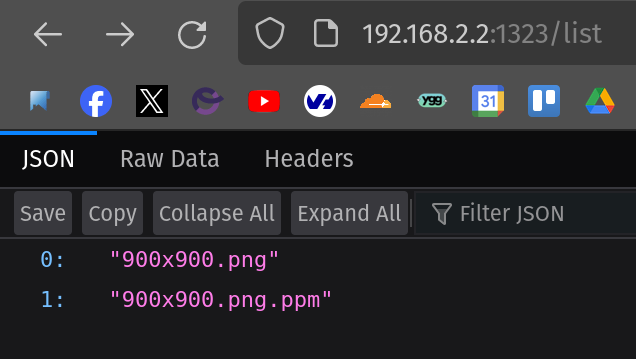
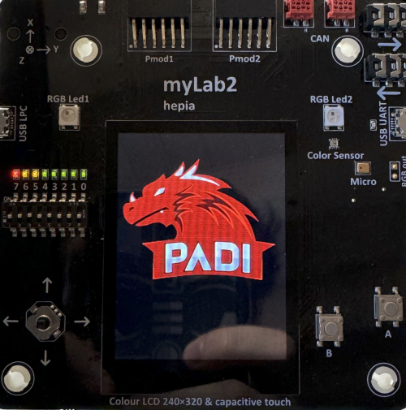
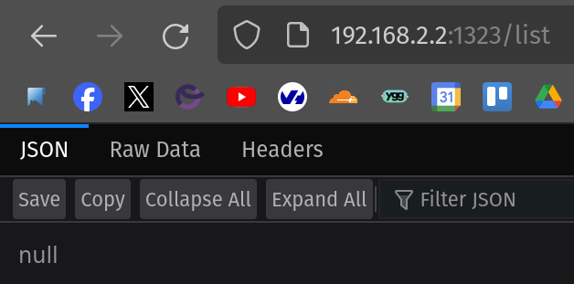
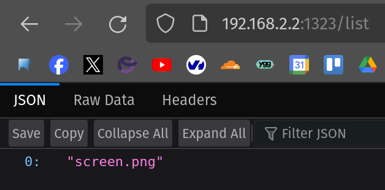
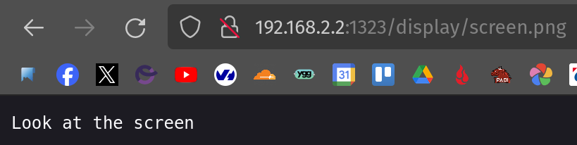
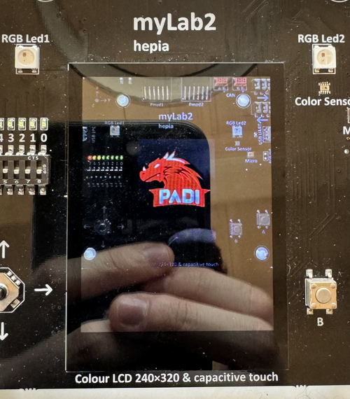

# Projet en Système Embarqué

# Table des matières
- [Projet en Système Embarqué](#projet-en-système-embarqué)
- [Table des matières](#table-des-matières)
- [Instruction \& Description](#instruction--description)
- [Mise en place de la communication série avec la carte](#mise-en-place-de-la-communication-série-avec-la-carte)
  - [Branchements sur la carte](#branchements-sur-la-carte)
  - [Picocom](#picocom)
- [Travail](#travail)
  - [Mise en place de Buildroot](#mise-en-place-de-buildroot)
  - [Support SPI](#support-spi)
  - [Câblage de l'écran LCD](#câblage-de-lécran-lcd)
  - [RootFS via NFS](#rootfs-via-nfs)
  - [Programmation de l’écran](#programmation-de-lécran)
  - [API REST](#api-rest)
  - [Intégration dans Buildroot](#intégration-dans-buildroot)
    - [Packaging des aplications](#packaging-des-aplications)
    - [Création de patchs](#création-de-patchs)
  - [Projet Personnel - Intégration I2C d'un Capteur de Température](#projet-personnel---intégration-i2c-dun-capteur-de-température)
- [Creators](#creators)
- [Copyright and license](#copyright-and-license)

# Instruction & Description

[Projet en Système Embarqué - Projet Image Viewer](https://gitedu.hesge.ch/lg_courses/ateliers_sys_embarques/ateliers_sys_embarques_pub/-/blob/main/lab/Image_viewer.pdf?ref_type=heads)

Dans ce projet vous allez vous familiariser avec Buildroot, un système de build populaire dans le monde de Linux embarqué. Vous allez ensuite découvrir une méthode pour accéder aux registres GPIO de votre plateforme depuis du code user space et utiliser l’API SPI de Linux pour piloter un écran LCD. Enfin, vous développerez un backend “image-viewer” dans un langage de haut-niveau (Go, C++, Rust, Python, . . . ) qui offrira une API REST permettant ainsi de piloter l’écran à distance via le réseau.

# Mise en place de la communication série avec la carte

## Branchements sur la carte

`TXD -> Blanc` 
`RXD -> Vert` 
`GND -> Noir` 
`X   -> Rouge`

## Picocom

`picocom -b 115200 /dev/ttyUSB0` 
L'utilisateur doit être dans le groupe `dialout` afin que cela fonctionne.

# Travail

## Mise en place de Buildroot

Pour commencer à mettre en place notre système, nous allons créer une nouvelle image sur la carte Sama5d3 en utilisant l'outil Buildroot. Pour se faire nous allons suivre [se tutoriel](https://www.linux4sam.org/bin/view/Linux4SAM/BuildRoot). Il nous permettra de configurer U-Boot et le noyau Linux à travers Buildroot et de généré une image que nous allons pouvoir flasher sur la carte SD.

Nous commençons par vérifier que nous avons bien tout les prérequis :

~~~cmd
❯ sudo apt-get install libssl-dev
Lecture des listes de paquets... Fait
Construction de l'arbre des dépendances... Fait
Lecture des informations d'état... Fait      
Paquets suggérés :
  libssl-doc
Les NOUVEAUX paquets suivants seront installés :
  libssl-dev
0 mis à jour, 1 nouvellement installés, 0 à enlever et 0 non mis à jour.
Il est nécessaire de prendre 0 o/2’376 ko dans les archives.
Après cette opération, 12.4 Mo d'espace disque supplémentaires seront utilisés.
Sélection du paquet libssl-dev:amd64 précédemment désélectionné.
(Lecture de la base de données... 286272 fichiers et répertoires déjà installés.)
Préparation du dépaquetage de .../libssl-dev_3.0.2-0ubuntu1.15_amd64.deb ...
Dépaquetage de libssl-dev:amd64 (3.0.2-0ubuntu1.15) ...
Paramétrage de libssl-dev:amd64 (3.0.2-0ubuntu1.15) ...
~~~

Nous pouvons ensuite télécharger le code source de buildroot-at91 et buildroot-external-microchip depuis leurs dépôts respectif :

~~~cmd
❯ git clone https://github.com/linux4sam/buildroot-at91.git
Clonage dans 'buildroot-at91'...
remote : Enumerating objects: 490125, done.
remote : Counting objects: 100% (110323/110323), done.
remote : Compressing objects: 100% (40932/40932), done.
remote : Total 490125 (delta 69808), reused 109167 (delta 69007), pack-reused 379802
Réception d'objets: 100% (490125/490125), 108.71 Mio | 20.15 Mio/s, fait.
Résolution des deltas: 100% (330044/330044), fait.
❯ git clone https://github.com/linux4microchip/buildroot-external-microchip.git
Clonage dans 'buildroot-external-microchip'...
remote : Enumerating objects: 9148, done.
remote : Counting objects: 100% (956/956), done.
remote : Compressing objects: 100% (224/224), done.
remote : Total 9148 (delta 798), reused 819 (delta 700), pack-reused 8192
Réception d'objets: 100% (9148/9148), 1.32 Mio | 8.85 Mio/s, fait.
Résolution des deltas: 100% (7076/7076), fait.
❯ ls
buildroot-at91  buildroot-external-microchip  README.md
~~~

Nous nous retrouvons maintenant avec 2 dossiers : `buildroot-at91` et `buildroot-external-microchip`.

Nous allons ensuite sélectionner les versions des deux dépôts dont nous avons besoin :

~~~cmd
❯ cd buildroot-external-microchip/
❯ git checkout linux4microchip-2023.10 -b buildroot-external-microchip-linux4microchip-2023.10
Basculement sur la nouvelle branche 'buildroot-external-microchip-linux4microchip-2023.10'
❯ cd ../buildroot-at91/
❯ git checkout linux4microchip-2023.10 -b buildroot-at91-linux4microchip-2023.10
Basculement sur la nouvelle branche 'buildroot-at91-linux4microchip-2023.10'
~~~

Avant le créer notre `image rootfs` :

~~~cmd
❯ make atmel_sama5d3_xplained_mmc_defconfig
mkdir -p /home/padi/Git/embedded_linux/Embedded_System/buildroot-at91/output/build/buildroot-config/lxdialog
PKG_CONFIG_PATH="" make CC="/usr/bin/gcc" HOSTCC="/usr/bin/gcc" \
    obj=/home/padi/Git/embedded_linux/Embedded_System/buildroot-at91/output/build/buildroot-config -C support/kconfig -f Makefile.br conf
/usr/bin/gcc -D_DEFAULT_SOURCE -D_XOPEN_SOURCE=600 -DCURSES_LOC="<ncurses.h>" -DNCURSES_WIDECHAR=1 -DLOCALE  -I/home/padi/Git/embedded_linux/Embedded_System/buildroot-at91/output/build/buildroot-config -DCONFIG_=\"\"   /home/padi/Git/embedded_linux/Embedded_System/buildroot-at91/output/build/buildroot-config/conf.o /home/padi/Git/embedded_linux/Embedded_System/buildroot-at91/output/build/buildroot-config/zconf.tab.o  -o /home/padi/Git/embedded_linux/Embedded_System/buildroot-at91/output/build/buildroot-config/conf
#
# configuration written to /home/padi/Git/embedded_linux/Embedded_System/buildroot-at91/.config
#
❯ BR2_EXTERNAL=../buildroot-external-microchip/ make sama5d3_xplained_graphics_defconfig
#
# configuration written to /home/padi/Git/embedded_linux/Embedded_System/buildroot-at91/.config
#
❯ make -j $(nproc)
[...]
~~~

Nous pouvons maintenant uploader l'image `output/images/sdcard.img` sur la carte SD grâce à la technique / outil de notre choix. Pour ma part, étant sur Pop-OS, je vais utiliser Popsicle.

Une fois la carte SD flashé, nous pouvons l'insérer dans notre Sama5d3, la démarrée et vérifier que tout se passe bien via picocom :

~~~cmd
RomBOOT

AT91Bootstrap 4.0.8 (2024-05-09 15:39:32)

ACT8865: Set REG1/REG2/REG3 Power-saving mode
SD/MMC: Image: Read file u-boot.bin to 0x26f00000
SD: Card Capacity: High or Extended
SD: Specification Version 3.0X
SD/MMC: Done to load image

<debug_uart>

U-Boot 2023.07.02-linux4microchip-2023.10 (May 09 2024 - 15:38:44 +0200)

CPU: SAMA5D36
Crystal frequency:       12 MHz
CPU clock        :      528 MHz
Master clock     :      132 MHz
DRAM:  256 MiB
Core:  208 devices, 19 uclasses, devicetree: separate
NAND:  256 MiB
MMC:   Atmel mci: 0, Atmel mci: 1
Loading Environment from FAT... OK
In:    serial@ffffee00
Out:   serial@ffffee00
Err:   serial@ffffee00
Net:   
Error: ethernet@f0028000 address not set.

Error: ethernet@f802c000 address not set.
No ethernet found.

Hit any key to stop autoboot:  0 
[...]
Welcome to the Microchip Demo
sama5 login: root
# 
~~~

Tout fonctionne comment attendu.

## Support SPI

Afin de faire fonctionner l'écran, nous allons devoir passer via le protocole SPI. Notre carte doit donc être capable de gérer le contrôleur SPI. Le noyau offre une API SPI exposée à l'espace utilisateur via la librairie `spidev` ainsi qu'un driver `spidev` exposé dans `/dev`.

Nous allons donc activé le support pour `spidev` en nous rendant, de nouveau, dans le dossier `buildroot-at91` et en effectuant les étapes suivantes :

~~~cmd
❯ make linux-menuconfig
~~~

- Device Drivers
  - SPI support
    - User mode SPI device driver support → `*`

~~~cmd
❯ make menuconfig
~~~

- System Configuration
  - /dev management
    - Dynamic using devtmpfs + mdev

Nous allons ensuite modifier le fichier `buildroot-at91/output/build/linux-custom/arch/arm/boot/dts/at91-sama5d3_xplained.dts` et modifier les ligne du `spi1: spi@f8008000` comme ceci :

~~~dts
spi1: spi@f8008000 {
  pinctrl-names = "default", "cs";
  pinctrl-1 = <&pinctrl_spi1_cs>;
  cs-gpios = <&pioC 25 0>;
  status = "okay";
  spidev@0 {
    compatible = "linux,spidev";
    spi-max-frequency = <24000000>;
    reg = <0>;
  };
};
~~~

Nous pouvons ensuite recompilez notre noyau :

~~~cmd
❯ make linux-rebuild
[...]
❯ make -j $(nproc)
[...]
~~~

Nous allons ensuite re-flasher notre carte SD et vérifier le bon support du SPI sur notre carte :

~~~cmd
# ls /dev | grep spidev
spidev1.0
~~~

## Câblage de l'écran LCD

Nous allons maintenant câblé l'écran à la sama5d3 en suivant les pins suivantes :

| **SAMA5D3** | **myLab2** |
| :---------: | :--------: |
|  J16 - P1   |  P1 - P12  |
|  J16 - P3   |  P1 - P13  |
|  J16 - P4   |  P1 - P11  |
|  J15 - P10  |  P1 - P14  |
| J19 - PA20  |  P1 - P19  |
| J19 - PA22  |  P3 - P6   |
|  J14 - 3V3  |  P2 - P1   |
|  J14 - GND  |  P1 - P1   |

## RootFS via NFS

Afin de facilité le développement et le rendre plus efficace, nous allons déplacer notre `rootFS` sur notre machine de développement. Pour se faire nous allons créer un serveur NFS sur notre machine de développement, indiqué à notre carte comment y accéder et faire que notre `rootFS` y trouve place.

Nous allons pouvoir suivre la marche a suivre que nous avons créée lors du [Lab 4 - Mini système embarqué avec Busybox](https://gitedu.hesge.ch/flg_courses/embedded_linux/students/michael.divia/-/blob/master/Embedded_Linux/lab_4/README.md?ref_type=heads#mise-en-place-du-serveur-nfs) du cours de `Linux embarqué` de Monsieur Glück.

Sur mon système de développement, nous commençons par créer un répertoire `nfsroot` et de le rajouter à notre gitignore :

~~~cmd
❯ mkdir nfsroot
❯ echo 'nfsroot' >> .gitignore
~~~

Nous pouvons maintenant commencer à installer NFS et à le configurer afin que notre nouveau dossier nfsroot soit la racine.

~~~cmd
❯ sudo apt-get install nfs-kernel-server -y
[...Successful Install]
❯ systemctl disable nfs-server
~~~

Nous désactivons içi le démarrage automatique de nfs-server afin de ne pas surcharger mon système de développement.

~~~cmd
❯ echo '/home/padi/Git/embedded_linux/Embedded_System/nfsroot/    127.0.0.1(rw,no_root_squash)' | sudo tee -a /etc/exports
❯ systemctl restart nfs-server
~~~

Nous rajoutons ensuite une ligne au fichier `/etc/exports` afin de share notre nouveau dossier avec les droits `Read/Write`.
Nous commençons par faire un test en permettant seulement notre machine de développement à accéder au share NFS.
Nous pouvons ensuite monter se share sur cette même machine.

~~~cmd
❯ mkdir /tmp/test_mount_nfs
❯ sudo mount 127.0.0.1:/home/padi/Git/embedded_linux/Embedded_System/nfsroot /tmp/test_mount_nfs
❯ cd /tmp/test_mount_nfs
❯ echo 'Hello World !' >> Hello.txt
❯ ls
Hello.txt
❯ ls /home/padi/Git/embedded_linux/Embedded_System/nfsroot
Hello.txt
❯ cat /home/padi/Git/embedded_linux/Embedded_System/nfsroot/Hello.txt
Hello World !
❯ cd ..
❯ sudo umount /tmp/test_mount_nfs
~~~

Maintenant que nous voyons que notre share NFS fonctionne nous devons juste aller modifier l'adresse IP dans /etc/exports afin que cette dernière sois celle de notre carte.

~~~cmd
❯ sed '$d' /etc/exports | sudo tee /etc/exports
❯ echo '/home/padi/Git/embedded_linux/Embedded_System/nfsroot/    192.168.2.2(rw,no_root_squash)' | sudo tee -a /etc/exports
/home/padi/Git/embedded_linux/Embedded_System/nfsroot/    192.168.2.2(rw,no_root_squash)
❯ systemctl restart nfs-server
~~~

Nous pouvons maintenant retourner dans le dossier `buildroot-at91` afin d'effectuer les modifications suivantes :

~~~cmd
❯ make uboot-menuconfig
~~~

Et modifier le `Boot arguments` comme ceci :

~~~cmd
root=/dev/nfs ip=192.168.2.2:::::eth0 nfsroot=192.168.2.1:/home/padi/Git/embedded_linux/Embedded_System/nfsroot,v3,tcp rw
~~~

Nous pouvons maintenant appliquer nos changement :

~~~cmd
❯ make -j $(nproc)
[...]
~~~

Puis re-flasher notre carte SD.

Pour terminer, nous allons remplir notre dossier `nfsroot` :

~~~cmd
❯ sudo tar -C /home/padi/Git/embedded_linux/Embedded_System/nfsroot -xf output/images/rootfs.tar
~~~

Nous pouvons maintenant redémarrer notre carte et vérifier que tout fonctionne.

Sur la carte :
~~~cmd
# touch test.txt
# ls
test.txt
~~~

Sur le système de développement :
~~~cmd
root@pop-os:/home/padi/Git/embedded_linux/Embedded_System/nfsroot/root# ls
test.txt
~~~

## Programmation de l’écran

Maintenant que notre `rootFS` est en NFS nous allons pouvoir tester si nous avons câblé correctement notre écran grâce au code mis a disposition par le professeur que nous pouvons trouver [ici](https://gitedu.hesge.ch/lg_courses/ateliers_sys_embarques/ateliers_sys_embarques_pub/-/raw/main/lab/resources/bin/display).

Dans notre part tout est bon, mise à part un problème au niveau des couleurs dépendamment du l'angle de vision. Mais ceci est un problème avec les carte et non de câblage ou de code.

Nous allons maintenant faire fonctionner notre écran à l'aide de notre propre code. Pour se faire nous allons nous aider du code squelette mis a disposition et créer un programme `display.c` :

~~~c
/*
 * Code skeleton to draw pixels on the MyLab2 LCD screen.
 */

#include <fcntl.h>
#include <unistd.h>
#include <errno.h>
#include <sys/mman.h>
#include <sys/ioctl.h>
#include <linux/types.h>
#include <linux/spi/spidev.h>

#include <stdint.h>
#include <string.h>
#include <stdio.h>
#include <stdlib.h>
#include <stdarg.h>
#include <assert.h>

//----------------------------------------------------------------
// Constants and macros
//----------------------------------------------------------------

#define XRES 240
#define YRES 320

#define SPIDEVNODE "/dev/spidev1.0"

#define SPI_CMD_DELAY 30

// 16bpp (RGB 5:6:5) pixel format:
// |15-11|10-05|04-00|
// |  R  |  G  |  B  |

#define COL8TO5(x) (x >> 3)
#define COL8TO6(x) (x >> 2)

#define RGB(r, g, b) ((COL8TO5(r) << 11) | (COL8TO6(g) << 5) | (COL8TO5(b)))

#define GREEN RGB(0, 255, 0)
#define GREY RGB(100, 100, 100)
#define LIGHT_RED RGB(255, 120, 120)

#define write_cmd(cmd) spi_write_cmd(disp, cmd)
#define write_data(data) spi_write_data(disp, data, sizeof(data))

// Datasheet doc: "Atmel-11121-32-bit-Cortex-A5-Microcontroller-SAMA5D3_Datasheet.pdf"

// Needed for mmap
// Addresses from p.30 of datasheet
#define SMC_BASE 0xffffc000
#define GPIOA_BASE_ADDR 0xfffff200
#define GPIOA_END_ADDR 0xfffff400

#define PIOA_MEM_SIZE (GPIOA_END_ADDR - SMC_BASE)
#define GPIOA_OFFSET (GPIOA_BASE_ADDR - SMC_BASE)

// Addresses from p.289 of datasheet
#define PIO_PER 0x0 // PIO Enable Register
#define PIO_PDR 0x4 // PIO Disable Register
#define PIO_PSR 0x8 // PIO Status Register

#define PIO_OER 0x10 // Output Enable Register
#define PIO_ODR 0x14 // Output Disable Register
#define PIO_OSR 0x18 // Output Status Register

#define PIO_SODR 0x30 // Set Output Data Register
#define PIO_CODR 0x34 // Clear Output Data Register

//----------------------------------------------------------------
// Types
//----------------------------------------------------------------

typedef struct
{
    int fd_spi;
    struct spi_ioc_transfer cmd;
} spi_display_t;

//----------------------------------------------------------------
// Variables
//----------------------------------------------------------------

static uint32_t spi_speed = 12000000;
static uint8_t spi_bits = 8;
static uint32_t spi_mode = 0;

static void *gpio_base_addr;

static uint32_t *gpio_pioa;

static uint32_t *gpio_pio_per;
static uint32_t *gpio_pio_pdr;
static uint32_t *gpio_pio_psr;

static uint32_t *gpio_pio_oer;
static uint32_t *gpio_pio_odr;
static uint32_t *gpio_pio_osr;

static uint32_t *gpio_pio_sodr;
static uint32_t *gpio_pio_codr;

static int fd;

//----------------------------------------------------------------
// Static functions
//----------------------------------------------------------------

/*
 * Print the global error message and abort execution.
 */
static void pabort(const char *s)
{
    perror(s);
    abort();
}

/**
 * @brief Write a command to the LCD screen through SPI
 * @param disp A pointer to a spi_display_t structure
 * @param cmd The command to be sent
 */
static void spi_write_cmd(spi_display_t *disp, uint8_t cmd)
{
    uint8_t unused[4096];

    // one byte for command
    struct spi_ioc_transfer msg = {
        .tx_buf = (unsigned long)&cmd,
        .rx_buf = (unsigned long)unused,
        .len = 1,
        .delay_usecs = SPI_CMD_DELAY,
        .speed_hz = spi_speed,
        .bits_per_word = spi_bits,
    };

    // Set data/cmd pin to 0
    *gpio_pio_codr = (1 << 20);

    // SPI_IOC_MESSAGE(1) indicates we are sending 1 message (the message "cmd"),
    // but we could send any number of messages at once
    // More details in kernel source: include/uapi/linux/spi/spidev.h
    if (ioctl(disp->fd_spi, SPI_IOC_MESSAGE(1), &msg) == -1)
        pabort("Failed sending spi message");
}

/**
 * @brief Write a command to the LCD screen through SPI
 * @param disp A pointer to a spi_display_t structure
 * @param data The data to be sent
 * @param data_len The data length in bytes
 */
static void spi_write_data(spi_display_t *disp, uint8_t const *data, size_t data_len)
{
    uint8_t unused[4096];

    // one byte for command
    struct spi_ioc_transfer msg = {
        .tx_buf = (unsigned long)data,
        .rx_buf = (unsigned long)unused,
        .len = data_len, // maximum data length is 4096 bytes
        .delay_usecs = SPI_CMD_DELAY,
        .speed_hz = spi_speed,
        .bits_per_word = spi_bits,
    };

    // Set data/cmd pin to 1
    *gpio_pio_sodr = (1 << 20);

    // SPI_IOC_MESSAGE(1) indicates we are sending 1 message (the message "cmd"),
    // but we could send any number of messages at once
    // More details in kernel source: include/uapi/linux/spi/spidev.h
    if (ioctl(disp->fd_spi, SPI_IOC_MESSAGE(1), &msg) == -1)
        pabort("Failed sending spi message");
}

/**
 * @brief Set a window to be written
 * @param disp A pointer to a spi_display_t structure
 * @param x0 The abscissa of the top-left point
 * @param y0 The ordinate of the top-left point
 * @param x1 The abscissa of the bottom-right point
 * @param y1 The ordinate of the bottom-right point
 */
static void disp_setwindow(spi_display_t *disp, int x0, int y0, int x1, int y1)
{
    assert(!(x1 > XRES - 1 || y1 > YRES - 1 || x0 > x1 || y0 > y1));

    int YSH = y0 >> 8;
    int YSL = y0;
    int YEH = y1 >> 8;
    int YEL = y1;

    // Set column (left and right zone)
    write_cmd(0x2A);
    {
        uint8_t dat[] = {0x00, x0, 0x00, x1};
        write_data(dat);
    }

    // Set page address (top and bottom lines)
    write_cmd(0x2B);
    {
        uint8_t dat[] = {YSH, YSL, YEH, YEL};
        write_data(dat);
    }

    // Memory write
    write_cmd(0x2C);
}

/**
 * @brief Initialize the LCD screen
 * @param disp A pointer to a spi_display_t structure
 */
static void disp_init(spi_display_t *disp)
{
    // SPI mode
    if (ioctl(disp->fd_spi, SPI_IOC_WR_MODE32, &spi_mode) == -1)
        pabort("Failed setting spi mode");

    // SPI bits per word
    if (ioctl(disp->fd_spi, SPI_IOC_WR_BITS_PER_WORD, &spi_bits) == -1)
        pabort("Failed setting spi bits per word");

    // SPI max speed in hz
    if (ioctl(disp->fd_spi, SPI_IOC_WR_MAX_SPEED_HZ, &spi_speed) == -1)
        pabort("Failed setting spi max speed");

    printf("SPI mode: 0x%x\n", spi_mode);
    printf("SPI bits per word: %d\n", spi_bits);
    printf("SPI max speed: %d Hz (%d KHz)\n", spi_speed, spi_speed / 1000);

    // Initialization sequence for the ILI9341 display (mylab2)
    write_cmd(0x01); // Software reset
    usleep(50000);   // Wait 50ms

    write_cmd(0x11);
    usleep(120000); // Wait 120ms

    write_cmd(0xCF);
    {
        uint8_t dat[] = {0x00, 0x83, 0x30};
        write_data(dat);
    }

    write_cmd(0xED);
    {
        uint8_t dat[] = {0x64, 0x03, 0x12, 0x81};
        write_data(dat);
    }

    write_cmd(0xE8);
    {
        uint8_t dat[] = {0x85, 0x01, 0x79};
        write_data(dat);
    }

    write_cmd(0xCB);
    {
        uint8_t dat[] = {0x39, 0x2C, 0x00, 0x34, 0x02};
        write_data(dat);
    }

    write_cmd(0xF7);
    {
        uint8_t dat[] = {0x20};
        write_data(dat);
    }

    write_cmd(0xEA);
    {
        uint8_t dat[] = {0x00, 0x00};
        write_data(dat);
    }

    write_cmd(0xC1); // Power control
    {
        uint8_t dat[] = {0x11}; // SAP[2:0];BT[3:0]
        write_data(dat);
    }

    write_cmd(0xC5); // VCM control 1
    {
        uint8_t dat[] = {0x34, 0x3D};
        write_data(dat);
    }

    write_cmd(0xC7); // VCM control 2
    {
        uint8_t dat[] = {0xC0};
        write_data(dat);
    }

    write_cmd(0x36); // Memory Access Control
    {
        uint8_t dat[] = {0x08};
        write_data(dat);
    }

    write_cmd(0x3A); // Pixel format
    {
        uint8_t dat[] = {0x55}; // 16bpp
        write_data(dat);
    }

    write_cmd(0xB1); // Frame rate
    {
        uint8_t dat[] = {0x00, 0x1D}; // 65Hz
        write_data(dat);
    }

    write_cmd(0xB6); // Display Function Control
    {
        uint8_t dat[] = {0x0A, 0xA2, 0x27, 0x00};
        write_data(dat);
    }

    write_cmd(0xb7); // Entry mode
    {
        uint8_t dat[] = {0x07};
        write_data(dat);
    }

    write_cmd(0xF2); // 3Gamma Function Disable
    {
        uint8_t dat[] = {0x08};
        write_data(dat);
    }

    write_cmd(0x26); // Gamma curve selected
    {
        uint8_t dat[] = {0x01};
        write_data(dat);
    }

    write_cmd(0xE0); // positive gamma correction
    {
        uint8_t dat[] = {0x1F, 0x1A, 0x18, 0x0A, 0x0F, 0x06, 0x45, 0x87, 0x32, 0x0A, 0x07, 0x02, 0x07, 0x05, 0x00};
        write_data(dat);
    }

    write_cmd(0xE1); // negamma correction
    {
        uint8_t dat[] = {0x00, 0x25, 0x27, 0x05, 0x10, 0x09, 0x3A, 0x78, 0x4D, 0x05, 0x18, 0x0D, 0x38, 0x3A, 0x1F};
        write_data(dat);
    }

    write_cmd(0x11); // Exit sleep
    usleep(120000);

    write_cmd(0x29); // Display on
    usleep(50000);

    // Set backlight pin to 1
    *gpio_pio_sodr = (1 << 22);
}

//----------------------------------------------------------------
// Functions
//----------------------------------------------------------------

/**
 * @brief Clear the screen - Display a uniform color
 * @param disp A pointer to a spi_display_t structure
 * @param color The color to be displayed
 * @note For performance and debug purpose, only clear a quarter of the screen
 */
void disp_clear(spi_display_t *disp, uint16_t color)
{
    disp_setwindow(disp, 0, 0, XRES / 2 - 1, YRES / 2 - 1);
    for (int i = 0; i < YRES / 2; i++)
    {
        for (int j = 0; j < XRES / 2; j++)
        {
            uint8_t m, n;
            m = color >> 8;
            n = color;
            {
                uint8_t dat[] = {m, n};
                write_data(dat);
            }
        }
    }
}

/**
 * @brief Set a pixel of the screen in a given color
 * @param disp A pointer to a spi_display_t structure
 * @param x The pixel abscissa
 * @param y The pixel ordinate
 * @param color The pixel color
 */
void disp_setpix(spi_display_t *disp, int x, int y, uint16_t color)
{
    disp_setwindow(disp, x, y, x, y);
    uint8_t m, n;
    m = color >> 8;
    n = color;
    {
        uint8_t dat[] = {m, n};
        write_data(dat);
    }
}

int gpio_init()
{
    int fd = open("/dev/mem", O_RDWR | O_SYNC);

    if (fd == -1)
    {
        fprintf(stderr, "Failed opening /dev/mem\n");
        return EXIT_FAILURE;
    }

    // Physical region [SMC_BASE, SMC_BASE+PIOA_MEM_SIZE] is mapped at virtual address gpio_base_addr.
    gpio_base_addr = mmap(0, PIOA_MEM_SIZE, PROT_READ | PROT_WRITE, MAP_SHARED, fd, SMC_BASE);

    if (gpio_base_addr == MAP_FAILED)
    {
        fprintf(stderr, "Failed memory mapping registers\n");
        close(fd);
        return EXIT_FAILURE;
    }

    gpio_pioa = gpio_base_addr + GPIOA_OFFSET;
    gpio_pio_per = gpio_pioa + PIO_PER / 4;
    gpio_pio_pdr = gpio_pioa + PIO_PDR / 4;
    gpio_pio_psr = gpio_pioa + PIO_PSR / 4;
    gpio_pio_oer = gpio_pioa + PIO_OER / 4;
    gpio_pio_odr = gpio_pioa + PIO_ODR / 4;
    gpio_pio_osr = gpio_pioa + PIO_OSR / 4;
    gpio_pio_sodr = gpio_pioa + PIO_SODR / 4;
    gpio_pio_codr = gpio_pioa + PIO_CODR / 4;

    // Enable pin
    // Command
    *gpio_pio_per = (1 << 20);
    // Backlight
    *gpio_pio_per = (1 << 22);

    // Configure pin as output (enable outpout)
    // Command
    *gpio_pio_oer = (1 << 20);
    // Write 0 to pin (clear)
    *gpio_pio_codr = (1 << 20);
    // Backlight
    *gpio_pio_oer = (1 << 22);
    // Write 0 to pin (clear)
    *gpio_pio_codr = (1 << 22);

    return EXIT_SUCCESS;
}

void destroy_gpio()
{
    // Disable pin
    // Command
    *gpio_pio_pdr = (1 << 20);
    // Backlight
    *gpio_pio_pdr = (1 << 22);

    close(fd);
    munmap(gpio_base_addr, PIOA_MEM_SIZE);
}

/**
 * @brief Main entry point
 */
int main()
{
    spi_display_t disp;

    if ((disp.fd_spi = open(SPIDEVNODE, O_RDWR)) == -1)
        pabort("Failed opening SPI device");

    // GPIOs initialization
    gpio_init();

    // Display initialization
    disp_init(&disp);

    disp_clear(&disp, LIGHT_RED);
    printf("Press ENTER key to Continue");
    getchar();

    disp_clear(&disp, GREY);
    printf("Press ENTER key to Continue");
    getchar();

    disp_setpix(&disp, 40, 40, GREEN);
    printf("Press ENTER key to Continue");
    getchar();

    // GPIOs shutdown
    destroy_gpio();

    close(disp.fd_spi);

    return EXIT_SUCCESS;
}
~~~

Nous pouvons ensuite compiler notre programme et le tester sur notre carte :

~~~cmd
❯ ./buildroot-at91/output/host/bin/arm-linux-gcc -o display display.c
~~~

L'affichage est très lent, nous allons devoir regrouper l'envoie des données afin de réduire l'overhead important que nous avons actuellement. Nous allons devoir modifier ces fonctions :

~~~c
static void spi_write_data(spi_display_t *disp, uint8_t const *data, size_t data_len)
{
    uint8_t unused[4096];
    int pos = 0;

    // Set data/cmd pin to 1
    *gpio_pio_sodr = (1 << 20);

    while (data_len > 4096)
    {
        uint8_t send_data[4096];

        for (int i = 0; i < 4096; i++)
        {
            send_data[i] = data[pos + i];
        }

        // one byte for command
        struct spi_ioc_transfer msg = {
            .tx_buf = (unsigned long)send_data,
            .rx_buf = (unsigned long)unused,
            .len = 4096, // maximum data length is 4096 bytes
            .delay_usecs = SPI_CMD_DELAY,
            .speed_hz = spi_speed,
            .bits_per_word = spi_bits,
        };

        // SPI_IOC_MESSAGE(1) indicates we are sending 1 message (the message "cmd"),
        // but we could send any number of messages at once
        // More details in kernel source: include/uapi/linux/spi/spidev.h
        if (ioctl(disp->fd_spi, SPI_IOC_MESSAGE(1), &msg) == -1)
        {
            pabort("Failed sending spi message");
        }

        data_len -= 4096;
        pos += 4096;
    }

    if (data_len > 0)
    {
        uint8_t send_data[data_len];

        for (int i = 0; i < data_len; i++)
        {
            send_data[i] = data[pos + i];
        }

        // one byte for command
        struct spi_ioc_transfer msg = {
            .tx_buf = (unsigned long)send_data,
            .rx_buf = (unsigned long)unused,
            .len = data_len, // maximum data length is 4096 bytes
            .delay_usecs = SPI_CMD_DELAY,
            .speed_hz = spi_speed,
            .bits_per_word = spi_bits,
        };

        // SPI_IOC_MESSAGE(1) indicates we are sending 1 message (the message "cmd"),
        // but we could send any number of messages at once
        // More details in kernel source: include/uapi/linux/spi/spidev.h
        if (ioctl(disp->fd_spi, SPI_IOC_MESSAGE(1), &msg) == -1)
        {
            pabort("Failed sending spi message");
        }
    }
}
~~~

~~~c
void disp_clear(spi_display_t *disp, uint16_t color)
{

    uint8_t dat_fast[((XRES / 2) * (YRES / 2)) * 2];

    int k = 0;

    disp_setwindow(disp, 0, 0, XRES / 2 - 1, YRES / 2 - 1);

    for (int i = 0; i < YRES / 2; i++)
    {
        for (int j = 0; j < XRES / 2; j++)
        {
            uint8_t m, n;
            m = color >> 8;
            n = color;

            dat_fast[k] = m;
            k++;
            dat_fast[k] = n;
            k++;
        }
    }

    write_data(dat_fast);
}
~~~

Maintenant que notre affichage tourne a une vitesse acceptable, nous pouvons commencer à afficher des images.

Nous allons commencé par créer une fonction nous permettant d'afficher les images au format `PPM` en utilisant [ce code](https://github.com/florentgluck/ppm) :

~~~c
#include "ppm.h"

void display_ppm_image(spi_display_t *disp, int x, int y, char *path)
{
    // Load PPM image
    img_t *img_ppm = load_ppm(path);

    printf("w: %d / h: %d\n", img_ppm->width, img_ppm->height);

    // Set window size
    disp_setwindow(disp, x, y, img_ppm->width - 1, img_ppm->height - 1);

    uint8_t send_data[((img_ppm->width) * (img_ppm->height)) * 2];

    int k = 0;

    for (int i = 0; i < img_ppm->height; i++)
    {
        for (int j = 0; j < img_ppm->width; j++)
        {
            pixel_t *pixel = &img_ppm->pix2d[i][j];
            uint16_t color = RGB(pixel->r, pixel->g, pixel->b);

            uint8_t m, n;

            m = color >> 8;
            n = color;

            send_data[k] = m;
            k++;
            send_data[k] = n;
            k++;
        }
    }

    write_data(send_data);
}
~~~

Nous pouvons tester notre fonction en rajoutant l'affichage d'une image dans notre main de `display.c` :

~~~c
int main()
{
    spi_display_t disp;

    if ((disp.fd_spi = open(SPIDEVNODE, O_RDWR)) == -1)
        pabort("Failed opening SPI device");

    // GPIOs initialization
    gpio_init();

    // Display initialization
    disp_init(&disp);

    disp_clear(&disp, LIGHT_RED);
    printf("Press ENTER key to Continue");
    getchar();

    disp_clear(&disp, GREY);
    printf("Press ENTER key to Continue");
    getchar();

    disp_setpix(&disp, 40, 40, GREEN);
    printf("Press ENTER key to Continue");
    getchar();

    // Display image
    display_ppm_image(&disp, 0, 0, "/root/image.ppm");
    printf("Press ENTER key to Continue");
    getchar();

    // GPIOs shutdown
    destroy_gpio();

    close(disp.fd_spi);

    return EXIT_SUCCESS;
}
~~~

et en recomplilant notre programme, puis en le testant sur notre carte :

~~~cmd
❯ ./buildroot-at91/output/host/bin/arm-linux-gcc -o display display.c ppm.c
~~~

Tout fonctionne comme attendu.

Nous allons maintenant ajouter le support pour les fichiers `jpg` et `png` à l'aide de [ImageMagick](https://imagemagick.org/script/convert.php).

ImageMagick a besin de `C++` pour fonctionner, nous devons donc en ajouter le support :

~~~cmd
❯ cd buildroot-at9
❯ make menuconfig
~~~

- Toolchain
  - Enable C++ support
- Targer packages
  - Graphic libraries and applications (graphic/text)
    - imagemagick
  - Libraries
    - Graphics
      - jpeg support
      - libpng

~~~cmd
❯ make -j $(nproc)
~~~

Nous pouvons maintenant re-flasher notre carte SD + extraire de nouveau notre nfsroot.

En allant sur notre carte nous pouvons tester que tout à fonctionner :

~~~cmd
# magick -help
Usage : magick tool [ {option} | {image} ... ] {output_image}
Usage : magick [ {option} | {image} ... ] {output_image}
       magick [ {option} | {image} ... ] -script {filename} [ {script_args} ...]
       magick -help | -version | -usage | -list {option}
~~~

Nous pouvons finalement créer une nouvelle fonctione dans `display.c` qui utilisera `ImageMagick` afin de convertire les fichier `PNG` et `JPG` ainsi que de redimentionner l'image si celle-ci est trop grande :

~~~c
void display_image(spi_display_t *disp, int x, int y, char *path)
{
    size_t len = strlen(path);

    if (len < 4)
    {
        return;
    }

    img_t *img_ppm;
    char output_path[1000];

    // Check if image is not a PPM
    if (strcmp(path + len - 4, ".ppm") != 0)
    {

        snprintf(output_path, sizeof(output_path), "%s.ppm", path);

        char command[1000];
        snprintf(command, sizeof(command), "magick %s %s", path, output_path);

        if (system(command) != 0)
        {
            printf("Failed to convert image to PPM format.\n");
            return;
        }

        img_ppm = load_ppm(output_path);
    }
    else
    {
        snprintf(output_path, sizeof(output_path), "%s", path);

        img_ppm = load_ppm(output_path);
    }

    // If the image is too big
    if (img_ppm->width > XRES)
    {
        char command[1000];
        snprintf(command, sizeof(command), "magick %s -resize '%d' %s", output_path, XRES, output_path);

        if (system(command) != 0)
        {
            printf("Failed to resize image (width).\n");
            return;
        }

        img_ppm = load_ppm(output_path);
    }

    if (img_ppm->height > YRES)
    {
        char command[1000];
        snprintf(command, sizeof(command), "magick %s -resize 'x%d' %s", output_path, YRES, output_path);

        if (system(command) != 0)
        {
            printf("Failed to resize image (height).\n");
            return;
        }

        img_ppm = load_ppm(output_path);
    }

    display_ppm_image(disp, x, y, img_ppm);
}
~~~

## API REST

Nous allons maintenant mettre en place une `API REST` en `Go` à l'aide du framework [Echo](https://echo.labstack.com/) permettant de d'uploader une image sur la carte, de télécharger une image de la carte, de lister les images disponible sur la carte, de supprimer une image de la carte et d'afficher une image sur l'écran de la myLab2.

Commençons par créer notre code en `Go` :

~~~cmd
❯ mkdir image-viewer
❯ cd image-viewer
❯ go mod init image-viewer
go : creating new go.mod: module image-viewer
❯ go get github.com/labstack/echo/v4
go : downloading github.com/labstack/echo/v4 v4.12.0
go : downloading github.com/labstack/echo v3.3.10+incompatible
go : downloading golang.org/x/net v0.24.0
go : downloading github.com/labstack/gommon v0.4.2
go : downloading golang.org/x/crypto v0.22.0
go : downloading github.com/valyala/fasttemplate v1.2.2
go : downloading github.com/mattn/go-colorable v0.1.13
go : downloading github.com/mattn/go-isatty v0.0.20
go : downloading golang.org/x/sys v0.19.0
go : downloading github.com/valyala/bytebufferpool v1.0.0
go : downloading golang.org/x/text v0.14.0
go : added github.com/labstack/echo/v4 v4.12.0
go : added github.com/labstack/gommon v0.4.2
go : added github.com/mattn/go-colorable v0.1.13
go : added github.com/mattn/go-isatty v0.0.20
go : added github.com/valyala/bytebufferpool v1.0.0
go : added github.com/valyala/fasttemplate v1.2.2
go : added golang.org/x/crypto v0.22.0
go : added golang.org/x/net v0.24.0
go : added golang.org/x/sys v0.19.0
go : added golang.org/x/text v0.14.0
❯ touch image-viewer.go
~~~

~~~go
package main

import (
	"fmt"
	"io"
	"net/http"
	"os"
	"os/exec"
	"path/filepath"
	"strings"

	"github.com/labstack/echo/v4"
)

func main() {

	e := echo.New()

	//*******************POST*******************

	//~~~~~~~~~~~~~~~Upload Image~~~~~~~~~~~~~~~

	e.POST("/upload", func(c echo.Context) error {

		// Read form data
		file, err := c.FormFile("file")

		if err != nil {
			return err
		}

		// Source
		src, err := file.Open()

		if err != nil {
			return c.String(http.StatusOK, "File does not exists\n")
		}
		defer src.Close()

		// Destination directory
		destDir := "/var/www/image-viewer/img/"

		// Ensure destination directory exists
		if err := os.MkdirAll(destDir, os.ModePerm); os.IsNotExist(err) {
			return c.String(http.StatusOK, "Destination directory does not exist\n")
		}

		// Destination
		dstPath := filepath.Join(destDir, file.Filename)
		dst, err := os.Create(dstPath)

		if err != nil {
			return c.String(http.StatusOK, "Couldn't create file\n")
		}
		defer dst.Close()

		// Copy
		if _, err = io.Copy(dst, src); err != nil {
			return c.String(http.StatusOK, "Couldn't copy file\n")
		}
		fmt.Printf("File uploaded: %s\n", dstPath)

		return c.String(http.StatusOK, "File uploaded successfully\n")
	})

	//*******************GET********************

	//~~~~~~~~~~~~~~Download Image~~~~~~~~~~~~~~

	e.GET("/download/:file", func(c echo.Context) error {

		// Read form data
		file := c.Param("file")

		file = "/var/www/image-viewer/img/" + file

		// Ensure file exists
		if _, err := os.Stat(file); os.IsNotExist(err) {
			return c.String(http.StatusOK, "File does not exist\n")
		}

		fmt.Printf("File download: %s\n", file)

		// Send file
		return c.File(file)
	})

	//~~~~~~~~~~~~~~~List Images~~~~~~~~~~~~~~~~

	e.GET("/list", func(c echo.Context) error {

		// Destination directory
		destDir := "/var/www/image-viewer/img/"

		// Ensure destination directory exists
		if err := os.MkdirAll(destDir, os.ModePerm); os.IsNotExist(err) {
			return c.String(http.StatusOK, "Destination directory does not exist\n")
		}

		// Read directory contents
		files, err := os.ReadDir(destDir)
		if err != nil {
			return err
		}

		// Extract image file names
		var imageList []string
		for _, file := range files {
			if !file.IsDir() && strings.HasSuffix(strings.ToLower(file.Name()), ".png") || strings.HasSuffix(strings.ToLower(file.Name()), ".jpg") || strings.HasSuffix(strings.ToLower(file.Name()), ".ppm") {
				imageList = append(imageList, file.Name())
			}
		}

		// Send list of images
		return c.JSON(http.StatusOK, imageList)
	})

	//~~~~~~~~~~~~~~Display Image~~~~~~~~~~~~~~~

	e.GET("/display/:file", func(c echo.Context) error {

		// Read form data
		file := c.Param("file")

		file = "/var/www/image-viewer/img/" + file

		// Ensure file exists
		if _, err := os.Stat(file); os.IsNotExist(err) {
			return c.String(http.StatusOK, "File does not exist\n")
		}

		// Display the image
		command := exec.Command("/var/www/image-viewer/api/display", file)

		if err := command.Start(); err != nil {
			return c.String(http.StatusOK, "Couldn't display image\n")
		}
		fmt.Printf("File displayed: %s\n", file)

		return c.String(http.StatusOK, "Look at the screen\n")
	})

	//******************DELETE******************

	//~~~~~~~~~~~~~~~Delete Image~~~~~~~~~~~~~~~

	e.DELETE("/delete/:file", func(c echo.Context) error {

		// Read form data
		file := c.Param("file")

		file = "/var/www/image-viewer/img/" + file

		// Ensure file exists
		if _, err := os.Stat(file); os.IsNotExist(err) {
			return c.String(http.StatusOK, "File does not exist\n")
		}

		// Delete
		if err := os.Remove(file); err != nil {
			return c.String(http.StatusOK, "Couldn't delete file\n")
		}
		fmt.Printf("File deleted: %s\n", file)

		return c.String(http.StatusOK, "File deleted successfully\n")
	})

	e.Logger.Fatal(e.Start(":1323"))
}
~~~

Et adapter notre programme `display` en concéquence :

~~~C
int main(int argc, char *argv[])
{
    spi_display_t disp;

    if ((disp.fd_spi = open(SPIDEVNODE, O_RDWR)) == -1)
        pabort("Failed opening SPI device");

    // GPIOs initialization
    gpio_init();

    // Display initialization
    disp_init(&disp);
    disp_clear(&disp, BLACK);

    // Display image
    display_image(&disp, 0, 0, argv[1]);

    // GPIOs shutdown
    // disp_clear(&disp, BLACK);
    // destroy_gpio();

    // close(disp.fd_spi);

    return EXIT_SUCCESS;
}
~~~

Nous allons aussi créer un répertoire dédier pour notre `API REST` :

~~~cmd
# tree www
www
`-- image-viewer
    |-- api
    `-- img

3 directories, 0 files
~~~

Nous pouvons finalement tout compiler et déplacer les programmes :

~~~cmd
❯ ./buildroot-at91/output/host/bin/arm-linux-gcc -o display display.c ppm.c
❯ cd image-viewer
❯ env GOOS=linux GOARCH=arm go build -o image-viewer
❯ cd ..
❯ cp display nfsroot/var/www/image-viewer/api/
❯ cp image-viewer/image-viewer nfsroot/var/www/image-viewer/api/
~~~

Finalement, `image-viewer` doit être automatiquement démmarré au boot :

~~~cmd
# cd /etc/init.d/
# vi S11imageviewer
~~~

~~~bash
# cat S11imageviewer 
#!/bin/sh
#
# Start image-viewer
#

/var/www/image-viewer/api/image-viewer &
~~~

~~~cmd
# chmod +x S11imageviewer
# chmod g-w,o-w S11imageviewer
# reboot
~~~

Notre carte devrai maintenant redémarrée puis notre `API REST` devrai directement être disponible après le boot.

~~~cmd
[... BOOT ...]
Starting mdev... OK
atmel_usba_udc 500000.gadget: MMIO registers at [mem 0xf8030000-0xf8033fff] mapped at (ptrval)
atmel_usba_udc 500000.gadget: FIFO at [mem 0x00500000-0x005fffff] mapped at (ptrval)
spidev : module is already loaded
spidev : module is already loaded
modprobe : can't load module spidev (kernel/drivers/spi/spidev.ko): Invalid argument
Seedinrandom : crng init done
g 2048 bits and crediting
Saving 2048 bits of creditable seed for next boot

   ____    __
  / __/___/ /  ___
 / _// __/ _ \/ _ \
/___/\__/_//_/\___/ v4.12.0
High performance, minimalist Go web framework
https ://echo.labstack.com
____________________________________O/_______
                                    O\
⇨ http server started on [::]:1323
Starting network: ip: RTNETLINK answers: File exists
FAIL

Welcome to Buildroot
buildroot login: 
~~~

## Intégration dans Buildroot

Maintenant que nous avons un backend `image-viewer` fonctionnel, nous désirons intégrer la génération de celui-ci dans Buildroot. Ce que l’on désire, c’est un patch contenant tous les changements nécessaires dans Buildroot, de sorte à ce qu’on puisse obtenir avec le Buildroot patché (et configuré ensuite
correctement), un rootfs qui contient le backend `image-viewer` et tout ce qui est nécessaire à ce que le système soit fonctionnel sans intervention humaine.

### Packaging des aplications

La première étape consiste à créer les packages buildroot qui contiendront notre application et notre backend.

Nous allons ajouter ceci à `buildroot-at91/package/Config.in` :

~~~in
menu "HEPIA - Custom packages"
        source "package/image-viewer/Config.in
endmenu
~~~

Puis nous créons `buildroot-at91/package/viewer/Config.in`

~~~in
config BR2_PACKAGE_IMAGE_VIEWER
	bool "Image Viewer"
	depends on BR2_PACKAGE_IMAGEMAGICK
	depends on BR2_PACKAGE_JPEG
	depends on BR2_PACKAGE_ZLIB
	help
	  Image Viewer is a tool to display Images on a MyLab2 Colour LCD 240x320 screen.
	  Images can be uploaded, deleted, listed downloaded and displayed via a REST API.
~~~

Puis nous créons `buildroot-at91/package/image-viewer/image-viewer.mk`

~~~mk
################################################################################
#
# image-viewer
#
################################################################################
IMAGE_VIEWER_VERSION = 1.0.0
IMAGE_VIEWER_SOURCE = image-viewer-$(IMAGE_VIEWER_VERSION).tgz
IMAGE_VIEWER_SITE = file://$(TOPDIR)/package/image-viewer
IMAGE_VIEWER_SITE_METHOD = file
IMAGE_VIEWER_LICENSE = MIT
IMAGE_VIEWER_LICENSE_FILES = COPYING
IMAGE_VIEWER_DEPENDENCIES = imagemagick jpeg zlib

define IMAGE_VIEWER_BUILD_CMDS
    $(call, Build/Extract/Default)
endef

define IMAGE_VIEWER_INSTALL_TARGET_CMDS
    $(INSTALL) -D -m 0755 $(@D)/image-viewer $(TARGET_DIR)/var/www/image-viewer/api/image-viewer
    $(INSTALL) -D -m 0755 $(@D)/display $(TARGET_DIR)/var/www/image-viewer/api/display
    $(INSTALL) -d -m 0755 $(TARGET_DIR)/var/www/image-viewer/img
    $(INSTALL) -m 0755 $(@D)/S11imageviewer $(TARGET_DIR)/etc/init.d/
endef

$(eval $(generic-package))
~~~

Il ne nous reste plus qu'a créer notre fichier `.tgz` :

~~~cmd
❯ mkdir files
❯ cp /nfsroot/var/www/image-viewer/api/display files/
❯ cp /nfsroot/var/www/image-viewer/api/image-viewer files/
❯ cp /etc/init.d/S11imageviewer files/
❯ tar czvf image-viewer-1.0.0.tgz files/
❯ rm -rf files
❯ cp image-viewer-1.0.0.tgz buildroot-at91/package/image-viewer/
~~~

Maintenant que tout est en place nous pouvons recompiler buildroot avec notre nouveau package :

~~~cmd
❯ cd buildroot-at91
❯ make menuconfig
~~~

- HEPIA - Custom packages
  - Image Viewer

~~~cmd
❯ make -j $(nproc)
[... Building ...]
❯ sudo rm -rf ../nfsroot/*
❯ sudo tar -C /home/padi/Git/embedded_linux/Embedded_System/nfsroot -xf output/images/rootfs.tar
~~~

Nous pouvons redémmarer notre carte et vérifier que tout fonctionne :

~~~cmd
❯ curl -X POST -F "file=@images/screen.png" http://192.168.2.2:1323/upload
File uploaded successfully
~~~

Notre a package fonctionne donc correctement !

### Création de patchs

Pour terminé nous allons crée 2 patchs : 1 pour notre package `image-viewer` et un pour mettre à jour le `device tree`.

~~~cmd
❯ rm -rf buildroot-at91/output
❯ rm -rf buildroot-at91/dl
❯ cd buildroot-at91
❯ git diff --cached --binary > image-viewer.patch
❯ mkdir ../patchs
❯ mv image-viewer.patch ../patchs
~~~

Nous pouvons tester se premier patch :

~~~cmd
❯ git clone https://github.com/linux4sam/buildroot-at91.git linux4sam
[... Cloning ...]
❯ cd linux4sam
❯ git apply ../patchs/image-viewer.patch
[...]
❯ make -j $(nproc)
[...]
~~~

Nous pouvons ensuite aller vérifier l'output afin de voir si les dossier et fichier pour `image-viewer` sont présent. Si nous regardons toute les dépendance, il devrai just nous manquer le support pour le SPI dans `linux-menuconfig` et les modifications pour dans le `dts`.

Se patch est différent car il devra affecté le kernel linux, nous allons donc le créer à la main. Voici le contenu de ce patch :

~~~cmd
--- /dev/null
+++ b/.config
@@ -0,0 +1,5236 @@
+#
+# Automatically generated file; DO NOT EDIT.
+# Linux/arm 5.10.80-linux4microchip-2021.10 Kernel Configuration
+#
+CONFIG_CC_VERSION_TEXT="arm-buildroot-linux-gnueabihf-gcc.br_real (Buildroot linux4microchip-2023.10-dirty) 11.4.0"
+CONFIG_CC_IS_GCC=y
[... (Un fichier de configuration complète pour linux-menuconfig) ...]
+# end of Kernel Testing and Coverage
+# end of Kernel hacking

--- a/arch/arm/boot/dts/at91-sama5d3_xplained.dts
+++ b/arch/arm/boot/dts/at91-sama5d3_xplained.dts
@@ -171,10 +171,15 @@
 			};
 
 			spi1 : spi@f8008000 {
-				pinctrl-names = "default";
-				pinctrl-0 = <&pinctrl_spi1_cs>;
+				pinctrl-names = "default", "cs";
+				pinctrl-1 = <&pinctrl_spi1_cs>;
 				cs-gpios = <&pioC 25 0>;
 				status = "okay";
+				spidev@0 {
+					compatible = "linux,spidev";
+					spi-max-frequency = <24000000>;
+					reg = <0>;
+				};
 			};
 
 			adc0 : adc@f8018000 {
~~~

Nous créons donc le fichier `.config` complet pour la compilation du kernel Linux car se dernier n'existe pas à moins que l'utilisateur ne face la commande `make linux-menuconfig`, ce que nous ne voulons pas, et nous modifions les lignes du fichier `DTS` en rapport avec le SPI pour l'écran.

Il ne nous reste donc plus qu'à éffectuer une ultime test :

~~~cmd
❯ git clone https://github.com/linux4sam/buildroot-at91.git linux4sam_2
[... Cloning ...]
❯ cd linux4sam_2
❯ git apply ../patchs/image-viewer.patch
[...]
❯ make menuconfig
~~~

- Kernel
  - Custom kernel patches → `/home/padi/Git/embedded_linux/Embedded_System/patchs/kernel/`

~~~cmd
❯ make uboot-menuconfig
~~~

- Boot arguments → `root=/dev/nfs ip=192.168.2.2:::::eth0 nfsroot=192.168.2.1:/home/padi/Git/embedded_linux/Embedded_System/nfsroot,v3,tcp rw`

~~~cmd
❯ make -j $(nproc)
[...]
~~~

Il ne nous reste plus qu'à flash notre carte SD et extraire l'archive `rootfs` dans notre dossier `nfsroot` et à booter la carte. Nous pouvons voir que tout a fonctionner, notre API REST est accécible et notre écran affiche bien les images demandées.

Notre travail est donc terminé.

## Projet Personnel - Intégration I2C d'un Capteur de Température

`I2C` étant déjà activé dans le Kernel, nous pouvons directement connecté notre capteur de température `Pmod TMP2` à notre `SAMA5D3` comme suit :

| **SAMA5D3** | **Pmod TMP2** |
| :---------: | :-----------: |
|    SCL0     |      SCL      |
|    SDA0     |      SDA      |
|     GND     |      GND      |
|     3V3     |      VDD      |

Nous pouvons ensuite vérifié que la carte peux bien communiqué avec le capteur graçe à la commande `i2cdetect` :

~~~cmd
# i2cdetect -y 0
     0  1  2  3  4  5  6  7  8  9  a  b  c  d  e  f
00:          -- -- -- -- -- -- -- -- -- -- -- -- -- 
10: -- -- -- -- -- -- -- -- -- -- -- -- -- -- -- -- 
20: -- -- -- -- -- -- -- -- -- -- -- -- -- -- -- -- 
30: -- -- -- -- -- -- -- -- -- -- -- -- -- -- -- -- 
40: -- -- -- -- -- -- -- -- -- -- -- 4b -- -- -- -- 
50: -- -- -- -- -- -- -- -- -- -- -- -- -- -- -- -- 
60: -- -- -- -- -- -- -- -- -- -- -- -- -- -- -- -- 
70: -- -- -- -- -- -- -- --
~~~

En regardant dans la [documentation](https://digilent.com/reference/pmod/pmodtmp2/reference-manual) du capteur, nous pouvons voir que l'adresse `0x4B` est bel et bien celle attendue si le JP1 et JP2 ne sont pas connecté.

Nous pouvons donc nous attaquer au code. Nous allons créer un nouveau programme `temp.c` et aussi adapter `display.c` afin de nous permettre d'afficher du texte. Tout les code peuvent être retrouvé dans le sous-répertoire `temperature`.

Le programme `temp` peut avoir 1 argument supplémentaire qui permettera de clear le screen avant de commencé l'affichage de la température. Ceci nous permet donc, si nous ne souhaitont, de ne pas supprimer l'image qui serai actuellement affichée sur notre écran.

De plus, seul la zone inférieur, où le texte est affiché, est clean avant chaque refresh de la température afin de toujour permettre l'affichage des images, qui elles sont collées en haut à gauche de l'écran.

# Creators

**Michael Divià**

- <https://gitedu.hesge.ch/michael.divia>

# Copyright and license

Code and documentation copyright 2023 the authors. Code released under the [MIT License](https://gitedu.hesge.ch/flg_courses/embedded_linux/students/michael.divia/-/blob/master/LICENSE).

Enjoy :metal: